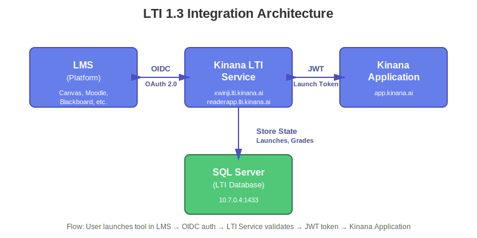

# Integration Architecture

## Overview

The Kinana Platform provides comprehensive integration capabilities to connect with external systems, Learning Management Systems (LMS), and third-party services. This document details the integration patterns, protocols, and implementations.

## Integration Patterns

### 1. API-Based Integration
RESTful APIs for programmatic access to platform features.

### 2. LTI Integration
Standards-based integration with Learning Management Systems.

### 3. Event-Driven Integration
Webhooks and event notifications for real-time updates.

### 4. Batch Integration
Scheduled data synchronization and bulk operations.

## LTI Integration

### LTI 1.3 Overview

**Learning Tools Interoperability (LTI) 1.3** is an IMS Global standard for integrating learning tools with LMS platforms.

**Key Features:**
- OAuth 2.0 / OpenID Connect based
- Secure tool launches
- Grade passback
- Deep linking
- Names and Role Provisioning

### LTI Architecture



The LTI integration follows the LTI Advantage 1.3 specification with OAuth 2.0 / OpenID Connect authentication flow.

### LTI Configuration

#### Tool Registration

**Tool Details:**
| Property | Value |
|----------|-------|
| Tool URL | https://[tenant].app.kinana.ai |
| Redirect URIs | https://[tenant].lti.kinana.ai/launch |
| Launch URL | https://[tenant].app.kinana.ai/lti/launch |
| JWKS URL | https://[tenant].lti.kinana.ai/.well-known/jwks.json |

**Supported Institutions:**

1. **General LTI (xwinji.lti.kinana.ai)**
   ```json
   {
     "client_id": "d84a22ff-7326-41f3-adce-5c9cb177e550",
     "tool_url": "https://xwinji.app.kinana.ai",
     "consumer_key": "Akadimi",
     "scope": "openid"
   }
   ```

2. **PAAET Specific (readerapp.lti.kinana.ai)**
   ```json
   {
     "client_id": "a2967543-a73f-4459-9b2a-6a3458bab2fe",
     "tool_url": "https://readerapp.app.kinana.ai",
     "consumer_key": "Akadimi"
   }
   ```

### LTI Launch Flow

#### Step 1: OIDC Login Initiation

```
1. LMS → Initiates Login
   GET /login_initiation
   Parameters:
     - iss: Platform issuer
     - login_hint: User identifier
     - target_link_uri: Destination URL
     - lti_message_hint: Context information
```

#### Step 2: Authentication Request

```
2. LTI Service → Redirects to LMS
   GET /authorize
   Parameters:
     - response_type: id_token
     - client_id: Tool client ID
     - redirect_uri: Launch endpoint
     - scope: openid
     - nonce: Security token
     - state: Session state
     - prompt: none
```

#### Step 3: Authentication Response

```
3. LMS → Returns to Tool
   POST /launch
   Parameters:
     - id_token: JWT with claims
     - state: Session state
```

#### Step 4: Token Validation

```javascript
// Validate ID token
const idToken = request.body.id_token;
const decodedToken = jwt.decode(idToken, { complete: true });

// Verify signature
const jwks = await fetchJWKS(platform.jwks_endpoint);
const publicKey = findKey(jwks, decodedToken.header.kid);
jwt.verify(idToken, publicKey);

// Validate claims
validateClaims(decodedToken.payload);
```

#### Step 5: Session Creation

```javascript
// Create session
const session = {
  launch_id: generateUUID(),
  user_id: idToken.sub,
  context_id: idToken['https://purl.imsglobal.org/spec/lti/claim/context'].id,
  resource_link_id: idToken['https://purl.imsglobal.org/spec/lti/claim/resource_link'].id,
  roles: idToken['https://purl.imsglobal.org/spec/lti/claim/roles'],
  launched_at: new Date()
};

// Store in database
await saveLaunchSession(session);

// Create application JWT
const appToken = createApplicationToken(session);

// Redirect to application
response.redirect(`${tool_url}/lti/entry?token=${appToken}`);
```

### LTI Claims

**Standard Claims:**
```json
{
  "iss": "https://lms.example.com",
  "sub": "user-123",
  "aud": "client-id",
  "exp": 1700000000,
  "iat": 1699996400,
  "nonce": "nonce-value",
  "https://purl.imsglobal.org/spec/lti/claim/message_type": "LtiResourceLinkRequest",
  "https://purl.imsglobal.org/spec/lti/claim/version": "1.3.0",
  "https://purl.imsglobal.org/spec/lti/claim/deployment_id": "deployment-1",
  "https://purl.imsglobal.org/spec/lti/claim/target_link_uri": "https://tool.example.com/launch",
  "https://purl.imsglobal.org/spec/lti/claim/resource_link": {
    "id": "resource-123",
    "title": "Chapter 1 Quiz"
  },
  "https://purl.imsglobal.org/spec/lti/claim/roles": [
    "http://purl.imsglobal.org/vocab/lis/v2/membership#Instructor"
  ],
  "https://purl.imsglobal.org/spec/lti/claim/context": {
    "id": "course-123",
    "label": "CS101",
    "title": "Introduction to Computer Science"
  }
}
```

### Grade Passback (Assignment and Grade Services)

#### Service Endpoint
```
POST /ags/lineitems/{lineitem_id}/scores
```

#### Score Submission
```json
{
  "timestamp": "2024-11-19T08:00:00Z",
  "scoreGiven": 85,
  "scoreMaximum": 100,
  "comment": "Good work!",
  "activityProgress": "Completed",
  "gradingProgress": "FullyGraded",
  "userId": "user-123"
}
```

#### Implementation
```javascript
async function submitGrade(launchId, userId, score, maximum) {
  // Get launch session
  const launch = await getLaunchSession(launchId);
  
  // Get AGS endpoint
  const agsEndpoint = launch.ags_endpoint;
  const lineItemUrl = launch.lineitem_url;
  
  // Get access token
  const accessToken = await getServiceAccessToken(launch.platform_id);
  
  // Submit score
  const response = await fetch(`${lineItemUrl}/scores`, {
    method: 'POST',
    headers: {
      'Authorization': `Bearer ${accessToken}`,
      'Content-Type': 'application/vnd.ims.lis.v1.score+json'
    },
    body: JSON.stringify({
      timestamp: new Date().toISOString(),
      scoreGiven: score,
      scoreMaximum: maximum,
      userId: userId,
      activityProgress: 'Completed',
      gradingProgress: 'FullyGraded'
    })
  });
  
  return response.status === 200;
}
```

### Deep Linking

**Purpose**: Allow instructors to select content within the LMS.

**Deep Linking Request:**
```json
{
  "https://purl.imsglobal.org/spec/lti/claim/message_type": "LtiDeepLinkingRequest",
  "https://purl.imsglobal.org/spec/lti-dl/claim/deep_linking_settings": {
    "deep_link_return_url": "https://lms.example.com/deep_link_return",
    "accept_types": ["link", "ltiResourceLink"],
    "accept_presentation_document_targets": ["iframe", "window"],
    "accept_multiple": true,
    "auto_create": false
  }
}
```

**Deep Linking Response:**
```javascript
// Content selection
const selectedContent = [
  {
    type: 'ltiResourceLink',
    title: 'Interactive Lesson 1',
    url: 'https://tool.example.com/lesson/1',
    custom: {
      lesson_id: '123'
    }
  }
];

// Create JWT response
const deepLinkingResponse = createJWT({
  iss: clientId,
  aud: platform.issuer,
  exp: Date.now() / 1000 + 3600,
  iat: Date.now() / 1000,
  nonce: generateNonce(),
  'https://purl.imsglobal.org/spec/lti/claim/message_type': 'LtiDeepLinkingResponse',
  'https://purl.imsglobal.org/spec/lti/claim/version': '1.3.0',
  'https://purl.imsglobal.org/spec/lti-dl/claim/content_items': selectedContent
});

// Redirect back to LMS
response.redirect(`${deep_link_return_url}?JWT=${deepLinkingResponse}`);
```

---

## API Integration

### RESTful API

**Base URL**: `https://api.kinana.ai`

**Authentication**: Bearer token (JWT)

**Common Headers:**
```
Authorization: Bearer <jwt_token>
Content-Type: application/json
Accept: application/json
X-Tenant-ID: <tenant_id>
```

### API Endpoints

#### Authentication
```
POST /auth/login
POST /auth/refresh
POST /auth/logout
```

#### Files
```
GET    /files
POST   /files
GET    /files/{id}
PUT    /files/{id}
DELETE /files/{id}
POST   /files/{id}/share
```

#### Users
```
GET    /users
POST   /users
GET    /users/{id}
PUT    /users/{id}
DELETE /users/{id}
```

### API Request Examples

#### Upload File
```bash
curl -X POST https://api.kinana.ai/files \
  -H "Authorization: Bearer <token>" \
  -H "Content-Type: multipart/form-data" \
  -F "file=@document.pdf" \
  -F "folder_id=123"
```

**Response:**
```json
{
  "id": "file-uuid",
  "name": "document.pdf",
  "size": 1048576,
  "mime_type": "application/pdf",
  "url": "https://api.kinana.ai/files/file-uuid/download",
  "created_at": "2024-11-19T08:00:00Z"
}
```

#### Get File Metadata
```bash
curl -X GET https://api.kinana.ai/files/file-uuid \
  -H "Authorization: Bearer <token>"
```

**Response:**
```json
{
  "id": "file-uuid",
  "name": "document.pdf",
  "size": 1048576,
  "mime_type": "application/pdf",
  "owner": {
    "id": "user-uuid",
    "name": "John Doe"
  },
  "folder": {
    "id": "folder-uuid",
    "name": "My Documents"
  },
  "created_at": "2024-11-19T08:00:00Z",
  "updated_at": "2024-11-19T08:00:00Z"
}
```

### Rate Limiting

**Limits:**
- 100 requests per minute per user
- 1000 requests per minute per tenant
- 10,000 requests per hour per IP

**Headers:**
```
X-RateLimit-Limit: 100
X-RateLimit-Remaining: 95
X-RateLimit-Reset: 1700000000
```

**Rate Limit Exceeded:**
```json
{
  "error": "rate_limit_exceeded",
  "message": "API rate limit exceeded",
  "retry_after": 60
}
```

---

## Webhook Integration

### Webhook Events

**Supported Events:**
- `file.created`
- `file.updated`
- `file.deleted`
- `user.created`
- `user.updated`
- `grade.submitted`

### Webhook Configuration

```json
{
  "url": "https://your-system.example.com/webhook",
  "events": ["file.created", "file.updated"],
  "secret": "webhook-secret-key",
  "active": true
}
```

### Webhook Payload

**Example: file.created**
```json
{
  "event": "file.created",
  "timestamp": "2024-11-19T08:00:00Z",
  "data": {
    "id": "file-uuid",
    "name": "document.pdf",
    "size": 1048576,
    "owner_id": "user-uuid",
    "created_at": "2024-11-19T08:00:00Z"
  }
}
```

### Webhook Security

**Signature Verification:**
```javascript
const crypto = require('crypto');

function verifyWebhookSignature(payload, signature, secret) {
  const computedSignature = crypto
    .createHmac('sha256', secret)
    .update(JSON.stringify(payload))
    .digest('hex');
  
  return crypto.timingSafeEqual(
    Buffer.from(signature),
    Buffer.from(computedSignature)
  );
}
```

---

## Azure Service Integration

### Azure Blob Storage

**Connection:**
- Using Azure Blob Storage CSI Driver
- Mounted as Kubernetes persistent volumes

**Access Pattern:**
```javascript
const { BlobServiceClient } = require('@azure/storage-blob');

const blobServiceClient = BlobServiceClient.fromConnectionString(
  process.env.AZURE_STORAGE_CONNECTION_STRING
);

const containerClient = blobServiceClient.getContainerClient('kinanafiles');
```

### Azure Key Vault

**Secret Retrieval:**
```javascript
const { SecretClient } = require('@azure/keyvault-secrets');
const { DefaultAzureCredential } = require('@azure/identity');

const credential = new DefaultAzureCredential();
const vaultUrl = 'https://ibt-prd-kv-01.vault.azure.net/';
const client = new SecretClient(vaultUrl, credential);

const secret = await client.getSecret('database-password');
```

---

## Third-Party Service Integration

### Translation Services

**Supported Providers:**
- Google Cloud Translation API
- Microsoft Azure Translator
- DeepL API

**Translation Request:**
```javascript
async function translateText(text, targetLang) {
  const response = await fetch('https://kintra.kinana.ai/translate', {
    method: 'POST',
    headers: {
      'Content-Type': 'application/json'
    },
    body: JSON.stringify({
      text: text,
      target_language: targetLang,
      source_language: 'auto'
    })
  });
  
  return response.json();
}
```

### PDF Processing

**Optimization Service:**
```bash
curl -X POST https://pdfopt.kinana.ai/optimize \
  -F "file=@document.pdf" \
  -F "quality=high"
```

**Translation Service:**
```bash
curl -X POST https://pdftra.kinana.ai/translate \
  -F "file=@document.pdf" \
  -F "target_lang=ar"
```

---

## Integration Best Practices

### Security
1. Always use HTTPS
2. Validate all inputs
3. Implement rate limiting
4. Use API keys with limited scope
5. Rotate credentials regularly

### Error Handling
1. Provide meaningful error messages
2. Use appropriate HTTP status codes
3. Implement retry logic with exponential backoff
4. Log all integration errors

### Performance
1. Implement caching where appropriate
2. Use pagination for large datasets
3. Compress responses
4. Monitor API performance

### Monitoring
1. Track API usage metrics
2. Monitor error rates
3. Set up alerts for failures
4. Log all integration activities

---

## Integration Testing

### LTI Testing

**Test Launch:**
```bash
# Use IMS Global LTI Advantage Test Suite
# https://lti-ri.imsglobal.org/
```

**Manual Testing:**
1. Configure test LMS (Canvas, Moodle, Blackboard)
2. Register tool
3. Create test course
4. Add LTI link
5. Launch as student/instructor
6. Verify functionality

### API Testing

**Postman Collection:**
```json
{
  "info": {
    "name": "Kinana API",
    "schema": "https://schema.getpostman.com/json/collection/v2.1.0/"
  },
  "item": [
    {
      "name": "Authentication",
      "item": [
        {
          "name": "Login",
          "request": {
            "method": "POST",
            "url": "{{base_url}}/auth/login",
            "body": {
              "email": "user@example.com",
              "password": "password"
            }
          }
        }
      ]
    }
  ]
}
```

---

**Document Version**: 1.0  
**Last Updated**: November 2024  
**Classification**: Unclassified
