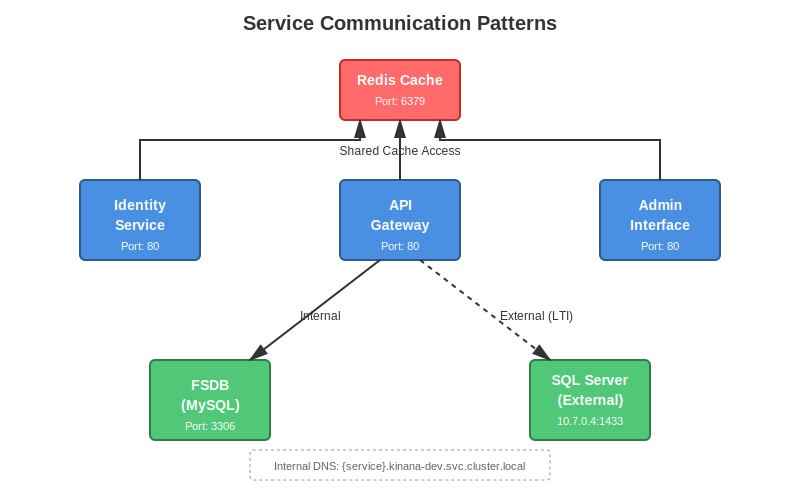

# System Architecture

## Overview

The Kinana Platform implements a layered microservices architecture deployed on Azure Kubernetes Service (AKS). This document details the system architecture, including service catalog, communication patterns, and deployment configurations.

## Architecture Layers

### Layer Architecture Diagram


The architecture is organized into 6 distinct layers, each serving a specific purpose:

1. **Layer 1 (Internet/Users)**: All external traffic entry point
2. **Layer 2 (Ingress/TLS)**: Security, routing, and certificate management
3. **Layer 3 (Core Services)**: Authentication, API gateway, and administration
4. **Layer 4 (Application Services)**: Specialized microservices for business logic
5. **Layer 5 (Data Layer)**: Caching and database services
6. **Layer 6 (Storage Layer)**: Persistent blob storage for files and media

## Service Catalog

### Microservices Overview


The platform consists of 20+ microservices organized into functional groups. Each service is containerized and runs independently with its own scaling configuration.

### Core Services

#### 1. Caching Layer (Redis)

**Purpose**: Session caching, application state, performance optimization

| Property | Value |
|----------|-------|
| Image | mcr.microsoft.com/oss/bitnami/redis:6.0.8 |
| Port | 6379 |
| Configuration | No password (development mode) |
| Namespace | kinana-dev |
| Scaling | Single replica |

**Environment Variables:**
```yaml
REDIS_DISABLE_COMMANDS: ""
```

**Access Pattern:**
- All .NET services connect via hostname "cache"
- Used for session storage and application state
- No persistence (in-memory only)

---

#### 2. Identity Service (id)

**Purpose**: Authentication, authorization, user management

| Property | Value |
|----------|-------|
| Image | uepcr.azurecr.io/kinanaid:1.0.0_dev |
| Port | 80 |
| Endpoints | *.id.kinana.ai, id.kinana.ai |

**Dependencies:**
- Redis cache

**Environment Variables:**
```yaml
REDIS: cache
ASPNETCORE_URLS: http://+:80
```

**Features:**
- OAuth 2.0 / OpenID Connect
- JWT token generation
- User registration and management
- Multi-tenant support

---

#### 3. API Gateway (api)

**Purpose**: Central API gateway, request routing, aggregation

| Property | Value |
|----------|-------|
| Image | uepcr.azurecr.io/kinanaapi:1.0.0_dev |
| Port | 80 |
| Endpoint | api.kinana.ai |

**Dependencies:**
- Redis cache
- Downstream services

**Special Configuration:**
```yaml
Caching: /api/files/* (30 days)
Max body size: 1500M
```

**Features:**
- Request aggregation
- Service discovery
- Load balancing
- Rate limiting
- Response caching

---

#### 4. Admin Interface (admin)

**Purpose**: Administrative dashboard, system management

| Property | Value |
|----------|-------|
| Image | uepcr.azurecr.io/kinanaadmin:1.0.0_dev |
| Port | 80 |
| Endpoints | *.admin.kinana.ai, admin.kinana.ai |

**Configuration:**
```yaml
Proxy buffer size: 8k
Proxy busy buffers: 16k
Max body size: 1500M
```

**Features:**
- User management
- Content moderation
- System configuration
- Analytics dashboard
- Audit logs

---

### Document & Content Services

#### 5. Document Service (docs)

**Purpose**: Document management, processing, storage

| Property | Value |
|----------|-------|
| Image | uepcr.azurecr.io/kinanadocs:1.0.0 |
| Port | 80 |
| Legacy Domain | docs.akadimi.io |

**Features:**
- Document upload and storage
- Metadata management
- Version control
- Access control
- Document preview

---

#### 6. File System Database (FSDB)

**Purpose**: Metadata for file system operations

| Property | Value |
|----------|-------|
| Image | uepcr.azurecr.io/kinanafsdb:1.0.0 |
| Type | MySQL |
| Port | 3306 |
| Credentials | root / Hard2Forget |

**Schema:**
- File metadata tables
- Folder structure
- Permission mappings
- Version history

---

#### 7. File System API (FSAPI)

**Purpose**: File upload, download, management

| Property | Value |
|----------|-------|
| Image | uepcr.azurecr.io/kinanafsapi:1.0.0 |
| Port | 8080 (exposed as 80) |
| Storage | Mounted to kinana-files-dev volume |
| Legacy Domain | fsapi.akadimi.io |

**Environment Variables:**
```yaml
APP_ENV: production
```

**Mount Points:**
```
/mnt/files → kinana-files-dev
```

**Features:**
- RESTful file API
- Chunked uploads
- Range requests
- Directory browsing
- File metadata

---

### PDF Processing Services

#### 8. PDF Viewer

**Purpose**: Render and display PDF documents

| Property | Value |
|----------|-------|
| Image | uepcr.azurecr.io/kinana-pdf-viewer:1.0.0_dev |
| Port | 80 |
| Legacy Domain | pdf.akadimi.io |

**Features:**
- Server-side PDF rendering
- Page navigation
- Zoom controls
- Text selection
- Annotation support

---

#### 9. PDF Optimization Service

**Purpose**: Compress, optimize PDF file sizes

| Property | Value |
|----------|-------|
| Image | uepcr.azurecr.io/kinana-pdf-optimization-service:1.0.0_dev |
| Port | 80 |
| Endpoint | pdfopt.kinana.ai |

**Storage Mounts:**
- Documents volume
- Raw documents volume

**Processing Features:**
- Image compression
- Font subsetting
- Remove unused objects
- Linearization for web

---

#### 10. PDF Translation Service

**Purpose**: Translate PDF content

| Property | Value |
|----------|-------|
| Image | uepcr.azurecr.io/kinana-pdf-translation-service:1.0.0_dev |
| Port | 80 |
| Endpoint | pdftra.kinana.ai |

**Features:**
- OCR text extraction
- Language detection
- Translation API integration
- Layout preservation
- Right-to-left (RTL) support

---

#### 11. PDF Images Service

**Purpose**: Extract images from PDF documents

| Property | Value |
|----------|-------|
| Image | uepcr.azurecr.io/kinana-pdf-images-service:1.0.0_dev |
| Port | 80 |
| Endpoint | pdfimg.kinana.ai |

**Features:**
- Image extraction
- Format conversion
- Resolution optimization
- Batch processing

---

### Translation Services

#### 12. Language Translation Service

**Purpose**: Multi-language content translation

| Property | Value |
|----------|-------|
| Image | uepcr.azurecr.io/kinana-language-translation-service:1.0.0_dev |
| Port | 80 |
| Endpoint | kintra.kinana.ai |

**Supported Languages:**
- Arabic (ar)
- English (en)
- French (fr)
- Spanish (es)

**Features:**
- Neural machine translation
- Context awareness
- Terminology management
- Quality estimation

---

### Web Applications

#### 13. Main Application (app)

**Purpose**: Primary learning application interface

| Property | Value |
|----------|-------|
| Image | uepcr.azurecr.io/kinanaapp:1.0.0_dev |
| Port | 80 |
| Endpoints | *.app.kinana.ai, app.kinana.ai |

**Features:**
- Student dashboard
- Course catalog
- Learning resources
- Progress tracking
- Assessment tools

---

#### 14. Marketing Website (www)

**Purpose**: Public-facing marketing website

| Property | Value |
|----------|-------|
| Image | uepcr.azurecr.io/kinanaweb:1.0.0_dev |
| Port | 3000 (exposed as 80) |
| Endpoint | www.kinana.ai |

**Technology:**
- Node.js / Express.js
- Static site generation
- SEO optimization

---

### LTI Integration Services

#### 15. LTI Main Service

**Purpose**: LTI 1.3 integration with external LMS platforms

| Property | Value |
|----------|-------|
| Image | uepcr.azurecr.io/kinana-lti:1.3.0_dev |
| Port | 3001 (exposed as 80) |
| Endpoint | xwinji.lti.kinana.ai |
| Database | SQL Server (10.7.0.4:1433) |

**Configuration:**
```yaml
Tool URL: https://xwinji.app.kinana.ai
Client ID: d84a22ff-7326-41f3-adce-5c9cb177e550
Consumer Key: Akadimi
Scope: openid
```

**Environment Variables:**
```yaml
PORT: 3001
HOST: 0.0.0.0
PRODUCTION: true
CACHE_TTL: 3600
SCOPE: openid
MSSQL_ENCRYPT: true
MSSQL_TRUST_SERVER_CERTIFICATE: true
```

---

#### 16. LTI PAAET Service

**Purpose**: LTI integration for PAAET institution

| Property | Value |
|----------|-------|
| Image | uepcr.azurecr.io/kinana-lti:1.3.0_dev |
| Port | 3001 (exposed as 80) |
| Endpoint | readerapp.lti.kinana.ai |
| Database | SQL Server (10.7.0.4:1433) |

**Configuration:**
```yaml
Tool URL: https://readerapp.app.kinana.ai
Client ID: a2967543-a73f-4459-9b2a-6a3458bab2fe
Consumer Key: Akadimi
```

---

## Service Communication

### Communication Architecture



Services communicate using multiple patterns optimized for different scenarios:

### Internal Communication

**Service Discovery:**
- Kubernetes DNS: `<service-name>.kinana-dev.svc.cluster.local`
- Service mesh ready (optional)
- No authentication for internal calls

**Example:**
```
http://cache.kinana-dev.svc.cluster.local:6379
http://fsdb.kinana-dev.svc.cluster.local:3306
```

### External Communication

**Ingress Pattern:**
```
User → DNS → NGINX Ingress → TLS Termination → Service
```

**Configuration:**
```yaml
nginx.ingress.kubernetes.io/proxy-body-size: 1500M
nginx.ingress.kubernetes.io/server-snippet: |
  underscores_in_headers on;
  client_max_body_size 2G;
```

### Database Connections

**MySQL (Internal):**
```
Host: fsdb.kinana-dev.svc.cluster.local
Port: 3306
User: root
Password: Hard2Forget
```

**SQL Server (External):**
```
Host: 10.7.0.4
Port: 1433
Database: lti_db
User: akadimi
Prefix: kinana
Encrypt: true
TrustServerCertificate: true
```

## Deployment Configuration

### Standard Pod Configuration

```yaml
replicas: 1
imagePullPolicy: Always
nodeSelector:
  kubernetes.io/os: linux
```

### Resource Limits (Recommended)

```yaml
resources:
  requests:
    memory: "256Mi"
    cpu: "100m"
  limits:
    memory: "1Gi"
    cpu: "1000m"
```

### Health Checks

**Liveness Probe:**
```yaml
livenessProbe:
  httpGet:
    path: /health
    port: 80
  initialDelaySeconds: 30
  periodSeconds: 10
```

**Readiness Probe:**
```yaml
readinessProbe:
  httpGet:
    path: /ready
    port: 80
  initialDelaySeconds: 5
  periodSeconds: 5
```

## Port Reference

| Service | Internal Port | Exposed Port | Protocol |
|---------|--------------|--------------|----------|
| Redis | 6379 | 6379 | TCP |
| Identity | 8080 | 80 | HTTP |
| API | 8080 | 80 | HTTP |
| Admin | 8080 | 80 | HTTP |
| FSDB (MySQL) | 3306 | 3306 | TCP |
| FSAPI | 8080 | 80 | HTTP |
| Website | 3000 | 80 | HTTP |
| LTI Services | 3001 | 80 | HTTP |
| All other services | 8080 | 80 | HTTP |

## Service Dependencies

### Dependency Graph

```
┌─────────┐
│  Redis  │◄─────────────┬─────────────┬──────────────┐
└─────────┘              │             │              │
                         │             │              │
                   ┌─────▼────┐   ┌───▼────┐   ┌────▼────┐
                   │ Identity │   │  API   │   │  Admin  │
                   └──────────┘   └────────┘   └─────────┘
                                       │
                              ┌────────┴────────┐
                              │                 │
                        ┌─────▼────┐      ┌────▼─────┐
                        │   FSAPI  │      │   Docs   │
                        └──────────┘      └──────────┘
                              │
                        ┌─────▼────┐
                        │   FSDB   │
                        └──────────┘
```

## Scaling Strategies

### Horizontal Scaling

**Stateless Services:**
```bash
kubectl scale deployment api --replicas=3 -n kinana-dev
```

**Stateful Services:**
- Use StatefulSets
- Implement leader election
- Configure persistent volumes

### Vertical Scaling

**Resource Adjustment:**
```yaml
resources:
  requests:
    memory: "512Mi"
    cpu: "500m"
  limits:
    memory: "2Gi"
    cpu: "2000m"
```

### Auto-Scaling (HPA)

```yaml
apiVersion: autoscaling/v2
kind: HorizontalPodAutoscaler
metadata:
  name: api-hpa
spec:
  scaleTargetRef:
    apiVersion: apps/v1
    kind: Deployment
    name: api
  minReplicas: 2
  maxReplicas: 10
  metrics:
  - type: Resource
    resource:
      name: cpu
      target:
        type: Utilization
        averageUtilization: 70
```

## Monitoring and Health

### Service Health Endpoints

| Service | Health Endpoint |
|---------|----------------|
| Identity | /health |
| API | /health |
| Admin | /health |
| FSAPI | /health |

### Metrics Collection

**Prometheus Annotations:**
```yaml
prometheus.io/scrape: "true"
prometheus.io/port: "80"
prometheus.io/path: "/metrics"
```

## Troubleshooting

### Common Issues

**1. Pod CrashLoopBackOff**
```bash
# Check logs
kubectl logs <pod-name> -n kinana-dev

# Describe pod for events
kubectl describe pod <pod-name> -n kinana-dev
```

**2. Service Unavailable**
```bash
# Check service endpoints
kubectl get endpoints -n kinana-dev

# Check ingress
kubectl describe ingress -n kinana-dev
```

**3. Database Connection Issues**
```bash
# Test MySQL connection
kubectl run -it --rm debug --image=mysql:8.0 --restart=Never \
  -- mysql -h fsdb.kinana-dev.svc.cluster.local -u root -p
```

### Quick Reference Commands

**View Service Health:**
```bash
kubectl get pods -n kinana-dev
kubectl get services -n kinana-dev
kubectl get ingress -n kinana-dev
```

**View Logs:**
```bash
kubectl logs -l app=<service-name> -n kinana-dev
kubectl logs -l app=<service-name> -n kinana-dev --tail=100 -f
```

**Scale Service:**
```bash
kubectl scale deployment <service-name> --replicas=3 -n kinana-dev
```

---

**Document Version**: 1.0  
**Last Updated**: November 2024  
**Classification**: Unclassified
