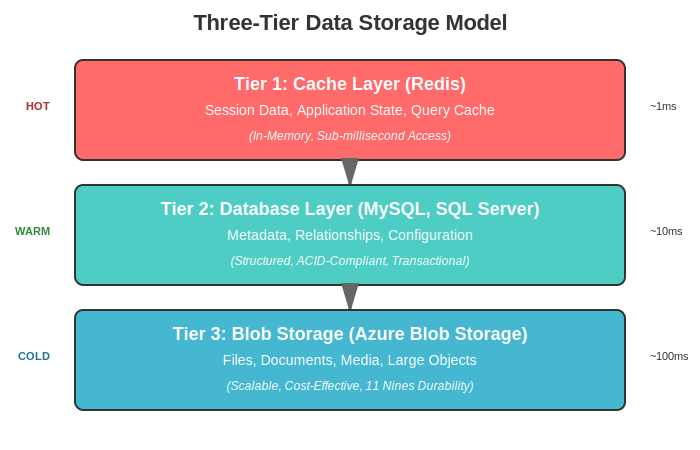

# Data Architecture Overview

## Introduction

The Kinana Platform's data architecture is designed to support a scalable, performant, and resilient educational content management system. This document provides an overview of the data storage strategy, data flow patterns, and data management principles.

## Data Architecture Principles

### 1. Data Separation
- **Operational Data**: Real-time application data (Redis, MySQL)
- **Persistent Storage**: Files, documents, media (Azure Blob Storage)
- **Integration Data**: LTI state and configuration (SQL Server)

### 2. Data Redundancy
- Multiple storage tiers for different data types
- Backup strategies for critical data
- Data replication where appropriate

### 3. Data Security
- Encryption at rest and in transit
- Access control and authentication
- Data isolation for multi-tenancy

### 4. Data Performance
- Caching layer for frequently accessed data
- Optimized storage for different data types
- Content delivery optimization

## Storage Architecture

### Three-Tier Storage Model



The Kinana Platform uses a three-tier storage model optimized for different data access patterns and performance requirements.

## Data Stores

### 1. Redis Cache

**Purpose**: High-speed data access

| Attribute | Details |
|-----------|---------|
| Type | In-memory key-value store |
| Version | 6.0.8 (Bitnami) |
| Deployment | Single instance (kinana-dev namespace) |
| Persistence | None (in-memory only) |
| Access Pattern | All .NET services via hostname "cache" |

**Use Cases:**
- Session storage
- Application state
- Query result caching
- Temporary data storage
- Rate limiting counters

**Data Patterns:**
```
Sessions: session:{user_id}:{session_id}
Cache: cache:{resource_type}:{resource_id}
Locks: lock:{resource}:{identifier}
```

---

### 2. MySQL Database (FSDB)

**Purpose**: File system metadata and relationships

| Attribute | Details |
|-----------|---------|
| Type | Relational Database |
| Deployment | Internal Kubernetes service |
| Access | Cluster-internal only |
| Credentials | Environment variables |

**Schema Categories:**
1. **File Metadata**
   - File properties (name, size, type)
   - Upload timestamps
   - Owner information
   - Access permissions

2. **Folder Structure**
   - Hierarchical organization
   - Parent-child relationships
   - Path mapping

3. **Permission Mappings**
   - User permissions
   - Group permissions
   - Role-based access

4. **Version History**
   - Version tracking
   - Change logs
   - Rollback capability

---

### 3. SQL Server Database (LTI)

**Purpose**: LTI integration state and configuration

| Attribute | Details |
|-----------|---------|
| Type | Relational Database |
| Location | External (10.7.0.4:1433) |
| Database Name | lti_db |
| User | akadimi |
| Prefix | kinana |
| Security | TLS with trust server certificate |

**Schema Categories:**
1. **LTI Configuration**
   - Tool registrations
   - Consumer keys
   - Client IDs
   - OAuth settings

2. **Session Management**
   - Launch sessions
   - State tokens
   - Nonce tracking

3. **Grade Management**
   - Gradebook columns
   - Score submissions
   - Grade history

---

### 4. Azure Blob Storage

**Purpose**: Large file storage

| Attribute | Details |
|-----------|---------|
| Provider | Azure Blob Storage |
| Driver | CSI Driver (blob.csi.azure.com) |
| Storage Class | azureblob-fuse-retain-premium |
| Reclaim Policy | Retain |
| Access Mode | ReadWriteMany |
| Performance Tier | Premium |

**Storage Organization:**

#### Legacy Namespace (akadimi-stg)

| Volume Name | Container | Purpose | Size | Access Pattern |
|-------------|-----------|---------|------|----------------|
| akadimi-medias-stg | medias | Media files storage | 10 Gi | Read-heavy |
| akadimi-embeddings-stg | vectors | Vector embeddings | 10 Gi | Read/Write |
| akadimi-n8n-stg | n8n | Workflow automation data | 10 Gi | Read/Write |
| akadimi-books-stg | books | E-book storage | 10 Gi | Read-heavy |
| akadimi-book-vectorindex-stg | book-vector-index | Book search indexes | 10 Gi | Read/Write |
| akadimi-webpagesvector-index-stg | webpages-vector-index | Web content indexes | 10 Gi | Read/Write |
| akadimi-mediaresources-stg | media-resources | Media metadata | 10 Gi | Read-heavy |

#### Current Namespace (kinana-dev)

| Volume Name | Container | Purpose | Size | Services |
|-------------|-----------|---------|------|----------|
| kinana-files-dev | kinanafiles | User uploaded files | 10 Gi | FSAPI |
| kinana-documents-dev | kinanadocuments | Processed documents | 10 Gi | PDF services |
| kinana-rawdocuments-dev | kinanarawdocuments | Unprocessed documents | 10 Gi | PDF services |

**Mount Path Convention:**
```
/mnt/<functional-name>

Examples:
/mnt/files        → kinana-files-dev
/mnt/documents    → kinana-documents-dev
/mnt/rawdocuments → kinana-rawdocuments-dev
```

## Data Flow Patterns

### 1. File Upload Flow

```
User → FSAPI → Validation → Azure Blob Storage
                ↓
              FSDB (metadata)
                ↓
              Redis (cache)
```

**Steps:**
1. User uploads file via FSAPI
2. FSAPI validates file (type, size, permissions)
3. File saved to Azure Blob Storage
4. Metadata stored in FSDB
5. Cache entry created in Redis
6. Response returned to user

### 2. PDF Processing Flow

```
User → Upload PDF → Raw Documents Storage
         ↓
    PDF Processing Service
         ↓
    ┌────┴────┬────────────┬─────────────┐
    ↓         ↓            ↓             ↓
Optimization Translation Image Extraction Viewing
    ↓         ↓            ↓             ↓
Processed Documents Storage
```

**Processing Steps:**
1. PDF uploaded to raw documents storage
2. Processing service triggered
3. Optimization, translation, or extraction performed
4. Result stored in processed documents storage
5. Metadata updated in FSDB
6. Cache invalidated

### 3. LTI Integration Flow

```
LMS → LTI Launch → Kinana LTI Service
                        ↓
                   Validate Launch
                        ↓
                   SQL Server (session)
                        ↓
                   Application Redirect
```

**Integration Steps:**
1. LMS initiates LTI launch
2. Kinana validates launch request
3. Session created in SQL Server
4. User redirected to application
5. Grade passback when applicable

### 4. Content Delivery Flow

```
User Request → NGINX Ingress → API Gateway
                                    ↓
                              Check Redis Cache
                                ↓       ↓
                            Hit         Miss
                             ↓           ↓
                        Return      Fetch from
                        Cached     Blob Storage
                        Content         ↓
                                   Update Cache
                                        ↓
                                   Return Content
```

## Data Management

### Caching Strategy

**Cache Layers:**
1. **Browser Cache**: Static assets (30 days)
2. **CDN Cache**: Media files (future enhancement)
3. **Application Cache**: Redis (TTL-based)
4. **Database Cache**: Query results

**Redis Configuration:**
```yaml
No password: Development mode
Persistence: Disabled
Eviction policy: LRU (Least Recently Used)
Max memory: Not set (uses available memory)
```

**Cache Patterns:**
```
# Session data (1 hour TTL)
session:{user_id}:{session_id}

# API responses (5 minutes TTL)
api:response:{endpoint}:{params}

# File metadata (1 hour TTL)
file:meta:{file_id}

# User permissions (30 minutes TTL)
user:perms:{user_id}
```

### Backup Strategy

**Backup Scope:**

| Data Type | Backup Method | Frequency | Retention |
|-----------|---------------|-----------|-----------|
| Persistent Volumes | Azure Blob Storage snapshots | Daily | 30 days |
| MySQL Database | Automated dumps | Daily | 30 days |
| SQL Server | Native backups | Daily | 30 days |
| Configuration | Git repository | On change | Indefinite |
| Certificates | Azure Key Vault | Continuous | 90 days |

**RTO/RPO Targets:**
- **RTO (Recovery Time Objective)**: 4 hours
- **RPO (Recovery Point Objective)**: 24 hours
- **Critical data RPO**: 1 hour

### Data Lifecycle Management

**File Lifecycle:**
```
Upload → Active Use → Archival → Deletion
         (Hot Tier)   (Cool Tier)  (Permanent)
          0-30 days   30-365 days   > 365 days
```

**Retention Policies:**
- User files: Retained until user deletion + 30 days
- Processed documents: 90 days after last access
- Logs: 90 days
- Audit trails: 7 years (compliance requirement)

### Data Security

**Encryption:**
- **At Rest**: Azure Storage Service Encryption
- **In Transit**: TLS 1.2+
- **Database**: Encrypted connections

**Access Control:**
- Role-based access control (RBAC)
- Service account isolation
- Least privilege principle
- API key rotation

**Data Isolation:**
- Tenant-specific data segregation
- Namespace-level isolation
- Container-level separation

## Performance Optimization

### Database Optimization

**MySQL (FSDB):**
```sql
-- Indexes on frequently queried columns
CREATE INDEX idx_file_owner ON files(owner_id);
CREATE INDEX idx_file_path ON files(path);
CREATE INDEX idx_file_created ON files(created_at);

-- Composite indexes
CREATE INDEX idx_file_owner_path ON files(owner_id, path);
```

**Query Optimization:**
- Use prepared statements
- Implement connection pooling
- Optimize JOIN operations
- Use appropriate indexes

### Storage Optimization

**Blob Storage:**
- Lifecycle policies for tier management
- Compression for text-based files
- CDN integration for global distribution
- Range requests for large files

**File Organization:**
```
/tenant/{tenant_id}/
  /files/{year}/{month}/{file_id}
  /documents/{category}/{document_id}
  /media/{type}/{media_id}
```

### Caching Optimization

**Redis Best Practices:**
- Set appropriate TTLs
- Use pipelining for bulk operations
- Implement cache warming
- Monitor memory usage
- Use appropriate data structures

## Monitoring and Metrics

### Key Metrics

**Database Metrics:**
- Connection pool utilization
- Query response time
- Slow query count
- Deadlock frequency
- Replication lag

**Storage Metrics:**
- Storage utilization (%)
- I/O operations per second
- Throughput (MB/s)
- Latency (ms)
- Failed requests

**Cache Metrics:**
- Hit rate (%)
- Miss rate (%)
- Memory utilization
- Eviction rate
- Connection count

### Monitoring Tools

**Recommended Stack:**
- Azure Monitor for storage metrics
- Prometheus for database metrics
- Grafana for visualization
- Application Insights for query performance

## Disaster Recovery

### Backup Procedures

**Daily Backups:**
```bash
# MySQL backup
kubectl exec -n kinana-dev fsdb-pod -- \
  mysqldump -u root -p kinana_db > backup.sql

# Upload to backup storage
az storage blob upload \
  --container-name backups \
  --file backup.sql \
  --name mysql-$(date +%Y%m%d).sql
```

**Recovery Procedures:**
1. Identify failure scope
2. Restore from most recent backup
3. Verify data integrity
4. Update DNS if necessary
5. Resume operations
6. Post-mortem analysis

### High Availability

**Database HA:**
- Master-slave replication (future)
- Automatic failover (future)
- Read replicas for scaling

**Storage HA:**
- Azure Blob Storage: Zone-redundant (ZRS)
- Geo-redundant storage (GRS) for critical data
- Automatic failover capabilities

## Data Governance

### Data Classification

| Classification | Description | Examples |
|----------------|-------------|----------|
| Public | Non-sensitive, public data | Marketing content, public documents |
| Internal | Internal use only | Course materials, internal docs |
| Confidential | Sensitive business data | Student records, grades |
| Restricted | Highly sensitive | PII, financial data |

### Compliance Requirements

**GDPR Compliance:**
- Right to access
- Right to erasure
- Data portability
- Consent management

**Data Retention:**
- Legal hold capabilities
- Automated deletion policies
- Audit trail preservation

## Future Enhancements

### Planned Improvements

1. **Database Scaling**
   - Read replicas for MySQL
   - Sharding strategy
   - Multi-region deployment

2. **Advanced Caching**
   - Redis Cluster for HA
   - Redis Sentinel for failover
   - Multi-tier caching

3. **Data Analytics**
   - Data warehouse integration
   - Real-time analytics
   - Machine learning pipelines

4. **Storage Optimization**
   - Intelligent tiering
   - Deduplication
   - Compression optimization

5. **Disaster Recovery**
   - Multi-region replication
   - Automated failover
   - Reduced RTO/RPO targets

---

**Document Version**: 1.0  
**Last Updated**: November 2024  
**Classification**: Unclassified
