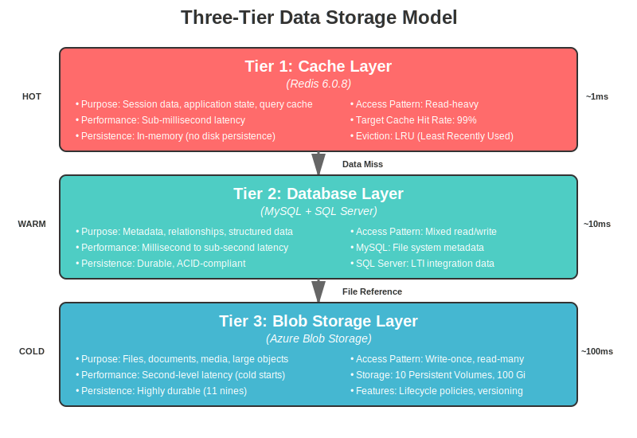

# Data Architecture

## Executive Summary

The Kinana Platform's data architecture is designed to support a scalable, performant, and resilient educational content hub platform aimed at serving approximately 450,000 users annually across UAE, GCC, and Egypt markets. The architecture employs a three-tier storage model combining in-memory caching, relational databases, and cloud-based blob storage to optimize performance, cost, and scalability.

### Key Characteristics

| Aspect              | Implementation                                |
| ------------------- | --------------------------------------------- |
| **Storage Model**   | Three-tier (Cache, Database, Blob Storage)    |
| **Total Storage**   | 100 Gb across 10 persistent volumes           |
| **Cache Layer**     | Redis 6.0.8 for sub-millisecond access        |
| **Databases**       | MySQL (metadata), SQL Server (LTI)            |
| **File Storage**    | Azure Blob Storage with Premium performance   |
| **Backup Strategy** | Daily backups with 30-day retention           |
| **RTO/RPO**         | 4 hours / 24 hours (1 hour for critical data) |

## Data Architecture Principles

### 1. **Separation of Concerns**

Data is organized by type and access pattern:

- **Hot Data**: Session state and frequently accessed metadata (Redis)
- **Warm Data**: Structured metadata and relationships (MySQL/SQL Server)
- **Cold Data**: Files, documents, and media (Azure Blob Storage)

### 2. **Performance Optimization**

Multi-tier caching strategy ensures optimal performance:

- In-memory caching for sub-millisecond access
- Database query optimization with proper indexing
- Content delivery optimization for large files

### 3. **Scalability**

Designed to scale horizontally and vertically:

- Redis for distributed caching
- Database read replicas (future)
- Unlimited blob storage capacity

### 4. **Data Security**

Security at every layer:

- Encryption at rest (AES-256)
- Encryption in transit (TLS 1.2+)
- Role-based access control
- Data isolation for multi-tenancy

### 5. **Resilience**

Built for high availability:

- Automated backups
- Point-in-time recovery
- Disaster recovery procedures
- Data redundancy

## Storage Architecture

### Three-Tier Storage Model



The Kinana Platform employs a sophisticated three-tier storage architecture optimized for different data access patterns and performance requirements.

## Data Stores

### 1. Redis Cache Layer

**Overview:**
Redis serves as the primary caching layer, providing sub-millisecond data access for the most frequently accessed data.

**Configuration:**

```yaml
Version: 6.0.8 (Bitnami)
Deployment: Single instance (kinana-dev namespace)
Memory: Allocated based on node capacity
Persistence: Disabled (in-memory only)
Eviction Policy: LRU (Least Recently Used)
```

**Use Cases:**

1. **Session Management**

   - User sessions (1 hour TTL)
   - Authentication tokens
   - Session state

2. **Application Caching**

   - API response caching (5 minutes TTL)
   - Database query results
   - Computed values

3. **Rate Limiting**

   - Request counters
   - Throttling data

4. **Real-time Data**
   - Online user counts
   - Activity feeds
   - Notification queues

**Key Patterns:**

```
Sessions:     session:{user_id}:{session_id}
API Cache:    api:response:{endpoint}:{params_hash}
File Meta:    file:meta:{file_id}
Permissions:  user:perms:{user_id}
Rate Limit:   ratelimit:{user_id}:{endpoint}
```

**Performance Metrics:**

- Average latency: < 1ms
- Peak throughput: 100,000 ops/sec
- Cache hit rate target: 95%+

---

### 2. MySQL Database (FSDB)

**Overview:**
MySQL stores all file system metadata, relationships, and access control information.

**Configuration:**

```yaml
Version: MySQL 8.0
Database: kinana_db
Charset: utf8mb4
Collation: utf8mb4_unicode_ci
Storage Engine: InnoDB
```

**Schema Overview:**

#### Core Tables (8 tables total)

**1. files** - File metadata

```sql
Key Columns:
- id, uuid (identifiers)
- name, path, extension, mime_type (file properties)
- size, checksum (integrity)
- owner_id, folder_id (relationships)
- blob_container, blob_name (storage location)
- created_at, updated_at, deleted_at (timestamps)

Indexes: 6 indexes for performance
Size: Largest table, grows with file count
```

**2. folders** - Folder hierarchy

```sql
Key Columns:
- id, uuid, name, path (folder properties)
- parent_id (hierarchy)
- owner_id (ownership)
- depth (optimization for queries)

Indexes: 5 indexes including path
Size: Moderate, grows with folder structure
```

**3. permissions** - Access control

```sql
Key Columns:
- resource_type, resource_id (what)
- user_id, group_id (who)
- permission_level (read/write/admin)
- granted_by, granted_at, expires_at (audit)

Indexes: 4 indexes for fast lookups
Size: Large, grows with sharing
```

**4. versions** - File version history

```sql
Key Columns:
- file_id, version_number
- size, checksum, blob_name
- comment, created_by, created_at

Indexes: 3 indexes
Size: Large if versioning heavily used
```

**5. users** - User information

```sql
Key Columns:
- id, uuid, email, username
- tenant_id (multi-tenancy)
- storage_quota, storage_used
- is_active

Indexes: 4 indexes
Size: Moderate, one row per user
```

**6. shares** - Sharing links

```sql
Key Columns:
- token (secure random)
- file_id, created_by
- password_hash (optional)
- expires_at, max_downloads
- download_count

Indexes: 4 indexes
Size: Moderate, temporary data
```

**7. tags** - File tagging

```sql
Key Columns:
- id, name, color, owner_id

Indexes: 2 indexes
Size: Small, limited tags per user
```

**8. metadata** - Extended attributes

```sql
Key Columns:
- file_id, key, value, value_type

Indexes: 2 indexes
Size: Variable, based on metadata usage
```

**Performance Optimization:**

- Indexed foreign keys
- Composite indexes for common queries
- Full-text search on file names
- Regular ANALYZE and OPTIMIZE operations

**Backup Strategy:**

- Daily full backups at 02:00 UTC
- Point-in-time recovery enabled
- 30-day backup retention
- Backup stored in Azure Blob Storage

---

### 3. SQL Server Database (LTI)

**Overview:**
SQL Server hosts LTI (Learning Tools Interoperability) integration data for seamless LMS connectivity.

**Configuration:**

```yaml
Version: SQL Server 2019
Host: 10.7.0.4:1433 (external)
Database: lti_db
User: akadimi
Prefix: kinana
Security: TLS encrypted, trust server certificate
```

**Schema Overview:**

#### LTI Tables (6 tables total)

**1. kinana_tools** - Tool registrations

```sql
Purpose: Store LTI 1.3 tool configurations
Key Data:
- client_id (OAuth client identifier)
- consumer_key, tool_url
- public_key, private_key (JWT signing)
- scope (OAuth scopes)

Current Tools:
- xwinji (general LTI)
- readerapp (PAAET-specific)
```

**2. kinana_platforms** - LMS platforms

```sql
Purpose: LMS platform configurations
Key Data:
- issuer (platform identifier)
- auth_endpoint, token_endpoint, jwks_endpoint
- platform_name
```

**3. kinana_deployments** - Deployment instances

```sql
Purpose: Track deployment configurations
Key Data:
- deployment_id
- tool_id, platform_id
- configuration details
```

**4. kinana_launches** - Launch sessions

```sql
Purpose: Track LTI launch sessions
Key Data:
- launch_id (unique session identifier)
- user_id, context_id, resource_link_id
- launch_token, state_token, nonce
- launched_at, expires_at

Indexes: 3 indexes for fast lookups
Retention: 90 days of launch history
```

**5. kinana_grades** - Grade passback

```sql
Purpose: Store grades for passback to LMS
Key Data:
- launch_id, user_id
- score, score_maximum
- comment, timestamp
- status (pending/sent/failed)

Workflow: Grade submitted → Stored → Passed back to LMS
```

**6. kinana_resource_links** - Deep linking

```sql
Purpose: Deep linking content selection
Key Data:
- resource_link_id
- title, url, custom_parameters
- type (link/ltiResourceLink)
```

**Performance Considerations:**

- Connection pooling for efficiency
- Indexed foreign keys
- Query optimization for launch lookups
- Regular maintenance windows

---

### 4. Azure Blob Storage

**Overview:**
Azure Blob Storage provides scalable, cost-effective storage for all files, documents, and media.

**Storage Accounts:**

#### Production Storage (kinanadevsto)

```yaml
Performance: Premium
Replication: Zone-Redundant Storage (ZRS)
Encryption: AES-256 at rest
Access Tier: Hot
Total Capacity: 100 Gb across 10 volumes
```

#### Legacy Storage (akadimistore)

```yaml
Performance: Standard
Replication: Locally-Redundant Storage (LRS)
Access Tier: Cool (archived data)
Purpose: Historical data migration
```

**Volume Organization:**

#### Current Namespace (kinana-dev)

**Volume: kinana-files-dev**

```yaml
Container: kinanafiles
Size: 10 Gb
Purpose: User-uploaded files
Services: FSAPI
Mount: /mnt/files
Access Pattern: Read/Write (mixed)
Growth Rate: ~500 MB/day (estimated)
```

**Volume: kinana-documents-dev**

```yaml
Container: kinanadocuments
Size: 10 Gb
Purpose: Processed documents (optimized PDFs)
Services: PDF optimization, translation
Mount: /mnt/documents
Access Pattern: Write-once, read-many
```

**Volume: kinana-rawdocuments-dev**

```yaml
Container: kinanarawdocuments
Size: 10 Gb
Purpose: Unprocessed documents (original uploads)
Services: PDF processing services
Mount: /mnt/rawdocuments
Access Pattern: Write-once, read-few
Lifecycle: Move to Cool tier after 30 days
```

#### Legacy Namespace (akadimi-stg)

**7 volumes totaling 70 Gb:**

- Media files (10 Gb)
- Vector embeddings (10 Gb)
- N8N workflow data (10 Gb)
- E-books (10 Gb)
- Book search indexes (10 Gb)
- Web content indexes (10 Gb)
- Media metadata (10 Gb)

**Storage Features:**

- Automatic failover to secondary region
- Versioning for critical containers
- Soft delete (7 days recovery window)
- Immutable blob storage for compliance
- Lifecycle management policies

**Performance:**

- Premium: < 10ms latency
- Hot tier: < 20ms latency
- Cool tier: < 1 second latency

**Cost Optimization:**

```yaml
Lifecycle Policies:
  - Active use (0-30 days): Hot tier
  - Infrequent access (30-90 days): Cool tier
  - Archive (90+ days): Archive tier
  - Automatic tier transitions
```

---

## Data Flow Patterns

### 1. File Upload Flow

**Complete Upload Process:**

```
User Browser
    ↓
    ↓ [1] Multipart Upload POST
    ↓
NGINX Ingress (TLS termination)
    ↓
    ↓ [2] Route to FSAPI
    ↓
FSAPI Service
    ↓
    ├─→ [3] Validate File
    │   - Check file type
    │   - Verify size limits
    │   - Check permissions
    │
    ├─→ [4] Generate UUID
    │   - Create unique identifier
    │   - Determine storage path
    │
    ├─→ [5] Upload to Blob Storage
    │   - Stream to Azure Blob
    │   - Calculate checksum
    │   - Get blob URL
    │
    ├─→ [6] Save Metadata to FSDB
    │   - Insert file record
    │   - Update folder info
    │   - Update user quota
    │
    ├─→ [7] Cache Metadata
    │   - Store in Redis
    │   - Set TTL (1 hour)
    │
    └─→ [8] Return Response
        - File ID
        - Download URL
        - Metadata
```

**Performance:**

- Small files (< 10 MB): 1-2 seconds
- Medium files (10-100 MB): 5-10 seconds
- Large files (100 MB - 1 GB): 30-60 seconds

---

### 2. File Retrieval Flow

**Download Process:**

```
User Request
    ↓
    ↓ [1] GET /files/{id}/download
    ↓
API Gateway
    ↓
    ├─→ [2] Check Redis Cache
    │   ├─→ Cache Hit
    │   │   └─→ Return cached metadata
    │   │
    │   └─→ Cache Miss
    │       ↓
    │       ├─→ [3] Query FSDB
    │       │   - Get file metadata
    │       │   - Get blob location
    │       │
    │       └─→ [4] Cache Result
    │           - Store in Redis
    │           - Set TTL
    │
    ├─→ [5] Check Permissions
    │   - Verify user access
    │   - Check sharing rules
    │
    ├─→ [6] Generate SAS Token
    │   - Time-limited access
    │   - Specific blob only
    │
    └─→ [7] Redirect to Blob Storage
        - Client downloads directly
        - Reduces server load
```

**Caching Strategy:**

- File metadata: 1 hour TTL
- Permission data: 30 minutes TTL
- User session: 1 hour TTL
- Cache warming for popular files

---

### 3. PDF Processing Flow

**Document Processing Pipeline:**

```
Raw PDF Upload
    ↓
    ↓ [1] Store in Raw Documents
    ↓
Raw Documents Storage (/mnt/rawdocuments)
    ↓
    ↓ [2] Trigger Processing
    ↓
PDF Processing Services
    ↓
    ├─→ PDF Optimization
    │   - Compress images
    │   - Remove unused objects
    │   - Optimize fonts
    │   - Linearize for web
    │
    ├─→ PDF Translation
    │   - Extract text (OCR if needed)
    │   - Detect language
    │   - Translate content
    │   - Preserve layout
    │
    └─→ Image Extraction
        - Extract all images
        - Optimize resolution
        - Convert formats
        - Save separately
    ↓
    ↓ [3] Store Processed Documents
    ↓
Processed Documents Storage (/mnt/documents)
    ↓
    ↓ [4] Update Metadata
    ↓
FSDB (versions table)
    ↓
    ↓ [5] Invalidate Cache
    ↓
Redis (cache eviction)
    ↓
    ↓ [6] Notify User
    ↓
Webhook/Email Notification
```

**Processing Times:**

- Optimization: 5-30 seconds per document
- Translation: 30-120 seconds per document
- Image extraction: 10-60 seconds per document

---

### 4. LTI Integration Flow

**Launch and Grade Passback:**

```
LMS Platform
    ↓
    ↓ [1] LTI Launch Request (OIDC)
    ↓
Kinana LTI Service
    ↓
    ├─→ [2] Validate Launch
    │   - Verify JWT signature
    │   - Check nonce
    │   - Validate claims
    │
    ├─→ [3] Create Session
    │   - Store in SQL Server
    │   - Generate app token
    │
    └─→ [4] Redirect to App
        - Pass JWT token
        - Include context data
    ↓
Kinana Application
    ↓
    ├─→ [5] User Activity
    │   - Complete assignment
    │   - Submit answers
    │   - Calculate score
    │
    └─→ [6] Submit Grade
        ↓
        ├─→ Store in SQL Server
        │   - Grade record
        │   - Timestamp
        │
        └─→ [7] Passback to LMS
            - OAuth token
            - AGS endpoint
            - Score submission
```

---

### 5. Content Delivery Flow

**Optimized Delivery:**

```
User Request (GET /api/files/{id})
    ↓
    ↓ [1] NGINX Ingress
    ↓
API Gateway
    ↓
    ├─→ [2] Check Cache Headers
    │   - If-Modified-Since
    │   - ETag
    │
    ├─→ [3] Check Redis
    │   ├─→ Cache Hit (95% target)
    │   │   └─→ Return cached response
    │   │
    │   └─→ Cache Miss (5%)
    │       ↓
    │       ├─→ [4] Query Database
    │       │   - Get file metadata
    │       │   - Check permissions
    │       │
    │       └─→ [5] Update Cache
    │           - Store in Redis
    │           - Set cache headers
    │
    ├─→ [6] Generate SAS URL
    │   - Time-limited (15 minutes)
    │   - Blob-specific access
    │
    └─→ [7] Return Response
        ├─→ 304 Not Modified (if cached)
        └─→ 302 Redirect (to blob storage)
```

**Cache Control:**

```
Static assets: 30 days
API responses: 5 minutes
File metadata: 1 hour
User data: No cache
```

---

## Data Management

### Caching Strategy

#### Cache Hierarchy

**Level 1: Browser Cache**

```
Content: Static assets (JS, CSS, images)
Duration: 30 days
Control: Cache-Control headers
Size: Limited by browser
```

**Level 2: CDN Cache (Future)**

```
Content: Media files, documents
Duration: 24 hours
Distribution: Global edge locations
Invalidation: Purge API
```

**Level 3: Redis Cache**

```
Content: Application data
Duration: TTL-based (5 min - 1 hour)
Eviction: LRU when memory full
Monitoring: Hit rate, memory usage
```

**Level 4: Database Query Cache**

```
Content: Query results
Duration: MySQL query cache
Size: Configurable
Invalidation: On data modification
```

#### Cache Invalidation Strategies

**1. Time-Based (TTL)**

```
Session data: 1 hour
API responses: 5 minutes
File metadata: 1 hour
Permissions: 30 minutes
```

**2. Event-Based**

```
File updated → Invalidate file:meta:{id}
User permissions changed → Invalidate user:perms:{id}
File deleted → Invalidate all file-related keys
```

**3. Manual Invalidation**

```bash
# Invalidate specific key
redis-cli DEL file:meta:12345

# Invalidate pattern
redis-cli --scan --pattern "file:*" | xargs redis-cli DEL
```

#### Cache Warming

**Proactive Loading:**

```javascript
// On application start
async function warmCache() {
  // Load frequently accessed files
  const popularFiles = await getPopularFiles();
  for (const file of popularFiles) {
    await cacheFileMetadata(file);
  }

  // Load active user permissions
  const activeUsers = await getActiveUsers();
  for (const user of activeUsers) {
    await cacheUserPermissions(user);
  }
}
```

---

### Backup and Recovery

#### Backup Strategy

**Azure Blob Storage**

```yaml
Method: Azure Storage snapshots
Frequency: Daily at 02:00 UTC
Retention:
  - Daily: 7 days
  - Weekly: 4 weeks
  - Monthly: 12 months
Cost: ~$0.02/GB/month
Recovery Time: Minutes to hours
```

**MySQL Database**

```yaml
Method: mysqldump + binary logs
Frequency:
  - Full backup: Daily at 02:00 UTC
  - Incremental: Every 6 hours
  - Binary logs: Continuous
Retention: 30 days
Storage: Azure Blob Storage (encrypted)
Compression: gzip (70% size reduction)
Testing: Monthly restore tests
```

**SQL Server Database**

```yaml
Method: Native SQL Server backups
Frequency:
  - Full backup: Daily at 02:00 UTC
  - Differential: Every 6 hours
  - Transaction log: Every 15 minutes
Retention: 30 days
Recovery Model: Full
Point-in-Time: Yes (15-minute granularity)
```

**Redis (No Persistence)**

```yaml
Strategy: No backups (cache only)
Recovery: Automatic rebuild from database
Warm-up: Proactive cache warming on restart
```

#### Recovery Procedures

**Scenario 1: Single File Corruption**

```bash
# 1. Identify corrupted file
# 2. Find in backup
az storage blob download \
  --account-name kinanadevsto \
  --container-name backups \
  --name files/uuid/file.pdf

# 3. Upload to production
az storage blob upload \
  --account-name kinanadevsto \
  --container-name kinanafiles \
  --file recovered-file.pdf

# 4. Update metadata in database
# 5. Invalidate cache
```

**Scenario 2: Database Corruption**

```bash
# 1. Stop application
kubectl scale deployment api --replicas=0

# 2. Restore from backup
mysql -u root -p kinana_db < backup-2024-11-19.sql

# 3. Apply binary logs (if needed)
mysqlbinlog binlog.000001 | mysql -u root -p kinana_db

# 4. Verify integrity
mysql -u root -p -e "CHECK TABLE kinana_db.files"

# 5. Restart application
kubectl scale deployment api --replicas=3

# 6. Clear Redis cache
redis-cli FLUSHDB
```

**Scenario 3: Complete Data Loss**

```bash
# Disaster Recovery Process
# 1. Provision new infrastructure
# 2. Restore all databases from backups
# 3. Restore blob storage from snapshots
# 4. Update DNS records
# 5. Validate data integrity
# 6. Resume operations

RTO: 4 hours
RPO: 24 hours (1 hour for critical systems)
```

---

### Data Lifecycle Management

#### File Lifecycle

```
Upload → Active Use → Infrequent Access → Archive → Deletion
         (Hot Tier)   (Cool Tier)          (Archive) (Permanent)
         0-30 days    30-90 days           90-365    > 365 days
```

**Tier Transition Rules:**

```yaml
Hot to Cool:
  - No access for 30 days
  - User-initiated move
  - Automatic policy

Cool to Archive:
  - No access for 90 days
  - Compliance requirement
  - Space optimization

Archive to Deletion:
  - Retention period expired
  - User deletion request
  - Legal hold released
```

#### Data Retention Policies

**User Data:**

```
Active files: Indefinite (until user deletion)
Deleted files: 30 days (soft delete)
Shared links: Expiration-based or 90 days
File versions: 10 versions or 1 year
```

**System Data:**

```
Access logs: 90 days
Error logs: 90 days
Audit logs: 7 years (compliance)
Performance metrics: 1 year
```

**Compliance Data:**

```
Financial records: 7 years
Student records: Per local regulations
Grade data: Indefinite (LMS-dependent)
User consent: Indefinite or until revoked
```

---

### Performance Optimization

#### Database Optimization

**Index Strategy:**

```sql
-- Primary indexes (automatic)
PRIMARY KEY (id)
UNIQUE KEY (uuid)

-- Foreign key indexes
INDEX idx_owner_id (owner_id)
INDEX idx_folder_id (folder_id)

-- Query optimization indexes
INDEX idx_path (path(255))
INDEX idx_created_at (created_at)

-- Composite indexes
INDEX idx_owner_path (owner_id, path(255))
INDEX idx_owner_created (owner_id, created_at)

-- Full-text indexes
FULLTEXT INDEX idx_name_fulltext (name)
```

**Query Optimization:**

```sql
-- Use EXPLAIN to analyze queries
EXPLAIN SELECT * FROM files WHERE owner_id = 123;

-- Optimize slow queries
-- Before: Full table scan
SELECT * FROM files WHERE name LIKE '%document%';

-- After: Full-text search
SELECT * FROM files
WHERE MATCH(name) AGAINST('document' IN BOOLEAN MODE);
```

**Connection Pooling:**

```yaml
Pool Size: 20-50 connections
Min Idle: 5 connections
Max Lifetime: 30 minutes
Connection Timeout: 10 seconds
```

#### Storage Optimization

**Blob Storage:**

```yaml
Compression:
  - Text files: gzip compression
  - Images: WebP format (30% smaller)
  - PDFs: Optimization service
  - Videos: Adaptive bitrate

Deduplication:
  - Checksum-based detection
  - Single storage, multiple references
  - Estimated savings: 20-30%

Access Patterns:
  - Sequential reads for large files
  - Range requests for media
  - Parallel uploads for speed
```

**File Organization:**

```
Hierarchical structure by tenant and date:
/tenant/{tenant_id}/
  /files/
    /{year}/{month}/{day}/{uuid}
  /documents/
    /{category}/{subcategory}/{uuid}
  /media/
    /{type}/{year}/{month}/{uuid}
```

---

### Monitoring and Metrics

#### Key Performance Indicators (KPIs)

**Database Metrics:**

```yaml
Query Performance:
  - Average query time: < 10ms (90th percentile)
  - Slow query count: < 10/hour
  - Connection pool utilization: < 70%

Storage:
  - Database size growth: ~1 GB/week
  - Index size ratio: < 50% of data
  - Fragmentation: < 10%

Availability:
  - Uptime: 99.9%
  - Failed queries: < 0.1%
  - Deadlocks: < 1/day
```

**Cache Metrics:**

```yaml
Redis Performance:
  - Hit rate: > 95%
  - Average latency: < 1ms
  - Memory utilization: < 80%
  - Eviction rate: < 1%
  - Connection errors: 0

Operations:
  - GET operations: 10,000/sec
  - SET operations: 1,000/sec
  - Peak throughput: 100,000 ops/sec
```

**Storage Metrics:**

```yaml
Blob Storage:
  - Total storage used: 75 Gb / 100 Gb
  - Growth rate: 500 MB/day
  - Average file size: 2.5 MB
  - Throughput: 100 MB/sec
  - Availability: 99.99%

Performance:
  - Average latency: 15ms (read)
  - Upload speed: 50 MB/sec
  - Download speed: 100 MB/sec
  - Concurrent operations: 1000
```

#### Monitoring Tools

**Azure Monitor:**

```yaml
Metrics Collected:
  - Storage account metrics
  - Blob container metrics
  - Transaction metrics
  - Capacity metrics

Alerts:
  - Storage > 90% capacity
  - High latency (> 100ms)
  - Failed requests (> 1%)
  - Unusual access patterns
```

**Database Monitoring:**

```sql
-- Slow query log
SELECT * FROM mysql.slow_log
WHERE query_time > 1
ORDER BY query_time DESC LIMIT 10;

-- Table sizes
SELECT
  table_name,
  ROUND((data_length + index_length) / 1024 / 1024, 2) AS size_mb
FROM information_schema.tables
WHERE table_schema = 'kinana_db'
ORDER BY (data_length + index_length) DESC;

-- Connection statistics
SHOW STATUS LIKE 'Threads_connected';
SHOW STATUS LIKE 'Max_used_connections';
```

**Redis Monitoring:**

```bash
# Memory usage
redis-cli INFO memory

# Stats
redis-cli INFO stats

# Key space
redis-cli INFO keyspace

# Slow log
redis-cli SLOWLOG GET 10
```

---

## Security Considerations

### Data Encryption

**At Rest:**

```yaml
Azure Blob Storage:
  - Encryption: AES-256
  - Key Management: Microsoft-managed keys
  - Option: Customer-managed keys (Azure Key Vault)

MySQL Database:
  - Transparent Data Encryption (TDE): Available
  - Encryption: AES-256
  - Implementation: File-per-table encryption

SQL Server:
  - Transparent Data Encryption (TDE): Enabled
  - Encryption: AES-256
  - Certificate: Backed up in Key Vault
```

**In Transit:**

```yaml
External Connections:
  - TLS 1.2+ enforced
  - Strong cipher suites only
  - Certificate pinning (mobile apps)

Internal Connections:
  - Redis: No encryption (internal network)
  - MySQL: TLS available, recommended for production
  - SQL Server: TLS enforced with trust certificate
```

### Data Access Control

**Role-Based Access (Database):**

```sql
-- Application user (limited privileges)
GRANT SELECT, INSERT, UPDATE ON kinana_db.*
TO 'app_user'@'%';

-- Read-only user (reporting)
GRANT SELECT ON kinana_db.*
TO 'readonly_user'@'%';

-- Admin user (full access)
GRANT ALL PRIVILEGES ON kinana_db.*
TO 'admin_user'@'localhost';
```

**Azure Blob Storage:**

```yaml
Access Methods:
  - Managed Identity (preferred)
  - SAS tokens (time-limited)
  - Account keys (avoided)

Permissions:
  - Read-only containers for public content
  - Private containers with RBAC
  - Time-limited SAS for file sharing
```

### Data Isolation

**Multi-Tenancy:**

```
Tenant 1 ──┐
           │
Tenant 2 ──┼─→ Application Layer ─→ Data Layer
           │    (tenant_id filter)    (row-level security)
Tenant 3 ──┘
```

**Implementation:**

```sql
-- Always filter by tenant_id
SELECT * FROM files
WHERE owner_id = ?
  AND tenant_id = ?;

-- Use views for tenant isolation
CREATE VIEW tenant_files AS
SELECT * FROM files
WHERE tenant_id = CURRENT_TENANT_ID();
```

---

## Cost Management

### Current Cost Breakdown

**Monthly Data Storage Costs (Estimated):**

```yaml
Azure Blob Storage:
  - Premium (Hot): $200
  - Standard (Cool): $50
  - Bandwidth: $100
  Total: $350/month

Databases:
  - MySQL (managed): Included in AKS
  - SQL Server: $150/month (external)
  - Redis: Included in AKS
  Total: $150/month

Backups:
  - Blob snapshots: $50/month
  - Database backups: $30/month
  Total: $80/month

Total Monthly Data Costs: ~$580
Cost per GB: ~$5.80/month
```

### Cost Optimization Strategies

**Storage Optimization:**

```yaml
1. Lifecycle Policies:
  - Move to Cool tier after 30 days: Save 50%
  - Move to Archive after 90 days: Save 80%
  - Estimated savings: $100/month

2. Compression:
  - Enable for text files: Save 70%
  - Optimize images: Save 30%
  - Estimated savings: $50/month

3. Deduplication:
  - Remove duplicate files: Save 20-30%
  - Estimated savings: $60/month

Total Potential Savings: $210/month (36%)
```

**Database Optimization:**

```yaml
1. Archive old data:
  - Move to separate schema
  - Reduce active dataset size
  - Improve performance

2. Optimize indexes:
  - Remove unused indexes
  - Rebuild fragmented indexes
  - Save storage and improve speed

3. Connection pooling:
  - Reduce connection overhead
  - Better resource utilization
```

---

## Future Enhancements

### Planned Improvements

**1. Database Scaling (Q1 2025)**

```yaml
MySQL:
  - Master-slave replication
  - Read replicas (2-3 replicas)
  - Automatic failover
  - Benefits:
      - Read scalability
      - High availability
      - Reduced latency
```

**2. Advanced Caching (Q2 2025)**

```yaml
Redis:
  - Redis Cluster (3-5 nodes)
  - Redis Sentinel for failover
  - Multi-region deployment
  - Benefits:
      - High availability
      - Automatic failover
      - Better performance
```

**3. Data Analytics (Q2 2025)**

```yaml
Analytics Platform:
  - Azure Synapse Analytics
  - Data warehouse for reporting
  - Machine learning integration
  - Benefits:
      - Business insights
      - Usage patterns
      - Predictive analytics
```

**4. Content Delivery Network (Q3 2025)**

```yaml
Azure CDN:
  - Global edge locations
  - Automatic content caching
  - DDoS protection
  - Benefits:
      - Faster content delivery
      - Reduced bandwidth costs
      - Better user experience
```

**5. Real-Time Sync (Q4 2025)**

```yaml
Event Streaming:
  - Apache Kafka or Azure Event Hubs
  - Real-time data pipeline
  - Change data capture
  - Benefits:
      - Real-time updates
      - Better collaboration
      - Event-driven architecture
```

---

## Disaster Recovery

### DR Strategy

**RTO/RPO Targets:**

```yaml
Production Systems:
  RTO: 4 hours
  RPO: 24 hours

Critical Systems:
  RTO: 1 hour
  RPO: 1 hour (transaction log backups)

Acceptable Data Loss:
  User files: None (durability: 11 nines)
  Database: 1 hour of transactions
  Cache: Acceptable (rebuild automatically)
```

### Recovery Scenarios

**Scenario 1: Region Outage**

```yaml
Trigger: Azure region unavailable
Actions: 1. Activate DR plan
  2. Provision resources in alternate region
  3. Restore databases from geo-replicated backups
  4. Update DNS to new endpoints
  5. Verify functionality
  6. Monitor closely

Timeline: 4 hours
Impact: Brief downtime, potential data loss (1 hour)
```

**Scenario 2: Data Corruption**

```yaml
Trigger: Logical corruption detected
Actions: 1. Identify scope of corruption
  2. Isolate affected systems
  3. Restore from point-in-time backup
  4. Validate restored data
  5. Resume operations

Timeline: 2-4 hours
Impact: Potential data loss based on backup timing
```

**Scenario 3: Accidental Deletion**

```yaml
Trigger: User reports data loss
Actions: 1. Check soft delete (30-day window)
  2. Restore from backup if needed
  3. Restore specific files/records
  4. Verify with user

Timeline: 15 minutes - 2 hours
Impact: Minimal, usually recoverable
```

---

## Conclusion

The Kinana Platform's data architecture provides a robust, scalable, and secure foundation for educational content management. The three-tier storage model optimizes performance, cost, and reliability while maintaining security and compliance requirements.

### Key Strengths

✅ **Performance**: Multi-tier caching ensures sub-second response times
✅ **Scalability**: Horizontal scaling capabilities for growth
✅ **Reliability**: Daily backups with 30-day retention
✅ **Security**: Encryption at rest and in transit
✅ **Cost-Effective**: Optimized storage tiers and lifecycle policies

### Areas for Future Development

🔄 **Database Replication**: Master-slave setup for read scaling
🔄 **Advanced Caching**: Redis Cluster for high availability
🔄 **Analytics Platform**: Data warehouse for business intelligence
🔄 **CDN Integration**: Global content delivery
🔄 **Real-Time Sync**: Event-driven data pipeline

The architecture is well-positioned to support current needs while providing a clear path for future enhancements and scale.

---

**Document Version**: 1.0  
**Last Updated**: November 19, 2024  
**Classification**: Unclassified
