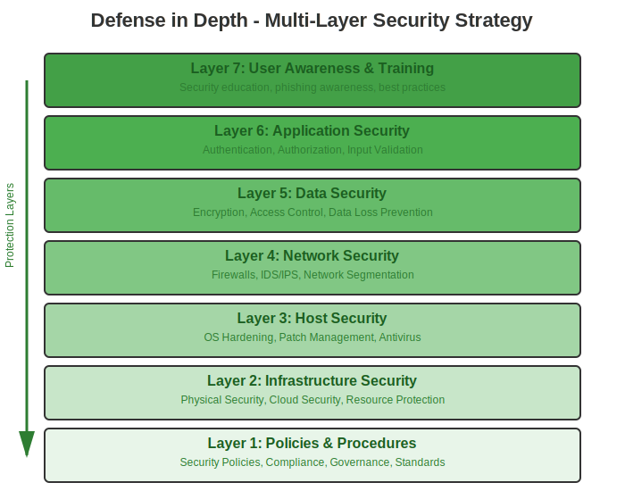
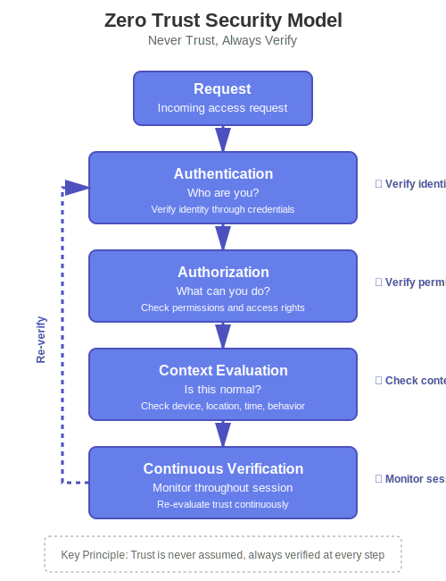
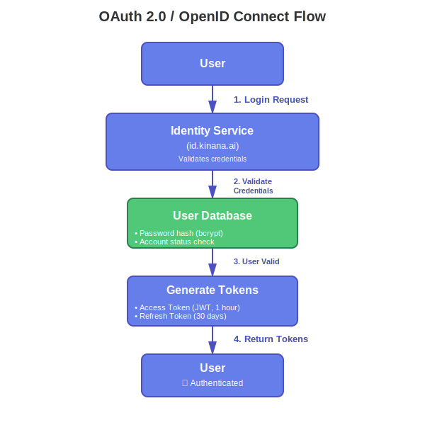
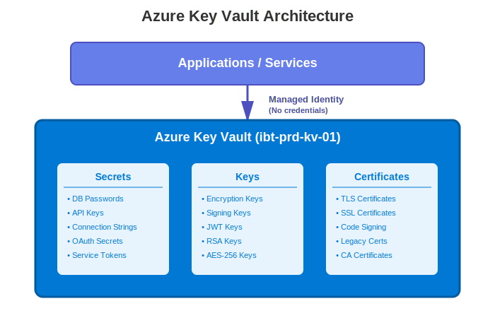
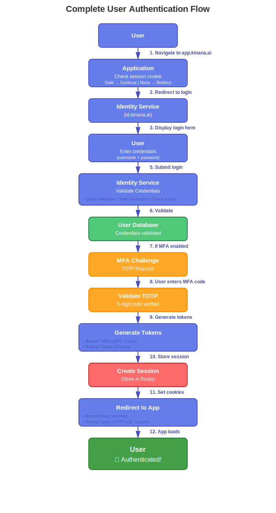
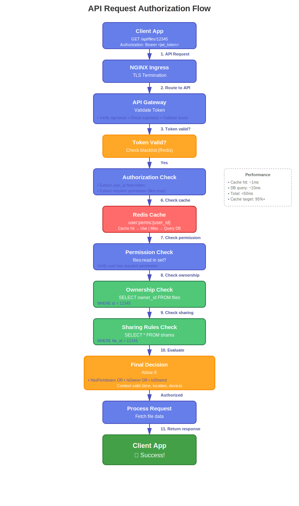

# Security Architecture

## Executive Summary

The Kinana Platform implements a comprehensive, defense-in-depth security architecture designed to protect data, ensure privacy, and maintain system integrity for approximately 450,000 users across educational institutions in UAE, GCC, and Egypt. The security framework encompasses network security, application security, data protection, and infrastructure security, all aligned with industry standards including GDPR, ISO 27001, and SOC 2.

### Security Overview

| Security Domain       | Implementation                                | Status         |
| --------------------- | --------------------------------------------- | -------------- |
| **Network Security**  | TLS 1.2+, NGINX Ingress, 18+ SSL certificates | ✅ Implemented |
| **Authentication**    | OAuth 2.0/OpenID Connect, JWT, MFA support    | ✅ Implemented |
| **Authorization**     | RBAC, permission-based access control         | ✅ Implemented |
| **Data Encryption**   | AES-256 at rest, TLS 1.2+ in transit          | ✅ Implemented |
| **Secret Management** | Azure Key Vault, Kubernetes Secrets           | ✅ Implemented |
| **Audit Logging**     | Comprehensive logging, 7-year retention       | ✅ Implemented |
| **Incident Response** | Defined procedures, 1-hour critical response  | ✅ Implemented |
| **Compliance**        | GDPR, ISO 27001, SOC 2                        | 🔄 In Progress |

## Security Principles

### 1. Defense in Depth

**Multi-Layer Security Strategy:**



Each layer provides independent protection, ensuring that if one layer is compromised, others continue to provide security.

---

### 2. Least Privilege

**Principle:** Every user, service, and component receives only the minimum permissions necessary to perform its function.

**Implementation:**

```yaml
Users:
  - Default role: Guest (view public content only)
  - Escalation: Request-based role assignment
  - Review: Quarterly access reviews

Services:
  - Service accounts: Minimal Kubernetes RBAC
  - Database users: Scoped to specific tables
  - API keys: Limited scope and expiration

Infrastructure:
  - Pod security: Non-root users
  - Network policies: Whitelist approach
  - Storage access: Time-limited SAS tokens
```

---

### 3. Zero Trust

**Principle:** Never trust, always verify. No implicit trust based on network location.

**Implementation:**



**Features:**

- No automatic trust for internal networks
- Every request authenticated and authorized
- Context-aware access decisions
- Continuous monitoring and re-evaluation

---

### 4. Security by Design

**Principle:** Security considerations integrated from the earliest design phase.

**Development Lifecycle:**

```
Requirements → Design → Implementation → Testing → Deployment
     ↓            ↓           ↓            ↓           ↓
  Threat      Security    Secure       Security    Security
  Modeling    Review      Coding       Testing     Hardening
```

**Practices:**

- Threat modeling during design
- Security code reviews
- Static code analysis
- Dynamic security testing
- Penetration testing

---

## Security Layers

### Layer 1: Network Security

#### External Network Protection

**TLS/SSL Encryption:**

```yaml
Configuration:
  Minimum Version: TLS 1.2
  Preferred Version: TLS 1.3
  Cipher Suites: Strong only (AES-256, ChaCha20)
  Certificate Provider: Let's Encrypt
  Certificate Management: Automated (cert-manager)
  Rotation: Automatic before expiration

Protocol Support: ✅ TLS 1.3 (preferred)
  ✅ TLS 1.2 (minimum)
  ❌ TLS 1.1 (disabled)
  ❌ TLS 1.0 (disabled)
  ❌ SSL 3.0 (disabled)
  ❌ SSL 2.0 (disabled)
```

**Certificate Management:**

```
cert-manager Controller
       ↓
   Monitors Certificate Resources
       ↓
   Requests from Let's Encrypt
       ↓
   Validates Domain (HTTP-01)
       ↓
   Stores in Kubernetes Secrets
       ↓
   NGINX Ingress Reads Secrets
       ↓
   Automatic Renewal (30 days before expiry)
```

**Active Certificates (18+):**

- Identity Services: `*.id.kinana.ai`, `id.kinana.ai`
- Admin Services: `*.admin.kinana.ai`, `admin.kinana.ai`
- Applications: `*.app.kinana.ai`, `app.kinana.ai`
- API Gateway: `api.kinana.ai`
- LTI Services: `*.lti.kinana.ai`
- PDF Services: `pdfopt.kinana.ai`, `pdftra.kinana.ai`, `pdfimg.kinana.ai`
- Translation: `kintra.kinana.ai`
- Public Site: `www.kinana.ai`

---

#### Ingress Security

**NGINX Ingress Controller Configuration:**

```yaml
# Security Headers
more_set_headers "X-Frame-Options: SAMEORIGIN";
more_set_headers "X-Content-Type-Options: nosniff";
more_set_headers "X-XSS-Protection: 1; mode=block";
more_set_headers "Strict-Transport-Security: max-age=31536000; includeSubDomains";
more_set_headers "Referrer-Policy: strict-origin-when-cross-origin";
more_set_headers "Content-Security-Policy: default-src 'self'";

# Request Limits
proxy-body-size: 1500M
client-max-body-size: 2G
proxy-read-timeout: 600s
proxy-send-timeout: 600s

# Rate Limiting (Global)
limit-req: 100 requests per minute per IP
limit-conn: 10 concurrent connections per IP

# Additional Security
enable-modsecurity: false (future)
enable-owasp-modsecurity-crs: false (future)
```

**Security Headers Explained:**

| Header                           | Purpose                   | Protection                   |
| -------------------------------- | ------------------------- | ---------------------------- |
| X-Frame-Options                  | Prevents clickjacking     | Blocks iframe embedding      |
| X-Content-Type-Options           | Prevents MIME sniffing    | Forces declared content type |
| X-XSS-Protection                 | XSS filter                | Browser XSS protection       |
| Strict-Transport-Security (HSTS) | Enforces HTTPS            | Prevents protocol downgrade  |
| Referrer-Policy                  | Controls referrer info    | Limits data leakage          |
| Content-Security-Policy          | Controls resource loading | Prevents XSS, injection      |

---

#### Internal Network Security

**Kubernetes Network Policies:**

```yaml
apiVersion: networking.k8s.io/v1
kind: NetworkPolicy
metadata:
  name: api-network-policy
  namespace: kinana-dev
spec:
  podSelector:
    matchLabels:
      app: api
  policyTypes:
    - Ingress
    - Egress

  # Ingress Rules
  ingress:
    # Allow from ingress controller
    - from:
        - namespaceSelector:
            matchLabels:
              name: ingress-nginx
      ports:
        - protocol: TCP
          port: 80

  # Egress Rules
  egress:
    # Allow to cache (Redis)
    - to:
        - podSelector:
            matchLabels:
              app: cache
      ports:
        - protocol: TCP
          port: 6379

    # Allow to database
    - to:
        - podSelector:
            matchLabels:
              app: fsdb
      ports:
        - protocol: TCP
          port: 3306

    # Allow DNS
    - to:
        - namespaceSelector:
            matchLabels:
              name: kube-system
      ports:
        - protocol: UDP
          port: 53
```

**Service Mesh (Future - Istio/Linkerd):**

```yaml
Features:
  - Mutual TLS between services
  - Fine-grained traffic policies
  - Circuit breaking
  - Rate limiting per service
  - Advanced observability
  - Zero-trust networking

Benefits:
  - Encrypted internal communication
  - Service-level authorization
  - Traffic control
  - Security without code changes
```

---

### Layer 2: Application Security

#### Authentication System

**OAuth 2.0 / OpenID Connect Implementation:**



The OAuth 2.0 / OpenID Connect flow handles user authentication and token generation.

**JWT Token Structure:**

```json
{
  "header": {
    "alg": "RS256",
    "typ": "JWT",
    "kid": "key-id-2024"
  },
  "payload": {
    "iss": "https://id.kinana.ai",
    "sub": "user-uuid-12345",
    "aud": ["kinana-api", "kinana-app"],
    "exp": 1700000000,
    "iat": 1699996400,
    "nbf": 1699996400,
    "jti": "token-uuid",
    "roles": ["student", "user"],
    "permissions": ["files:read", "files:write", "courses:read"],
    "tenant_id": "tenant_001",
    "email": "user@example.com",
    "email_verified": true,
    "name": "John Doe"
  },
  "signature": "..."
}
```

**Token Lifecycle Management:**

```yaml
Access Token:
  Lifetime: 1 hour
  Purpose: API authentication
  Storage: Memory only (never localStorage)
  Revocation: Blacklist in Redis

Refresh Token:
  Lifetime: 30 days
  Purpose: Obtain new access tokens
  Storage: Secure, HTTP-only cookie
  Rotation: New token on each refresh
  Revocation: Database + Redis blacklist

Token Validation:
  - Signature verification (RS256)
  - Expiration check
  - Issuer validation
  - Audience validation
  - Blacklist check (revoked tokens)
```

**Multi-Factor Authentication (MFA):**

```yaml
Support: TOTP (Time-based One-Time Password)
Apps: Google Authenticator, Authy, Microsoft Authenticator

Enrollment Flow: 1. User enables MFA in settings
  2. System generates secret key
  3. Display QR code
  4. User scans with authenticator app
  5. User enters verification code
  6. System validates and enables MFA

Login Flow: 1. User provides username/password
  2. System validates credentials
  3. Request MFA code
  4. User enters 6-digit code
  5. System validates TOTP
  6. Issue tokens

Backup Codes:
  - 10 single-use backup codes
  - Encrypted storage
  - Regeneration on request
```

---

#### Authorization System

**Role-Based Access Control (RBAC):**

```
User → Roles → Permissions → Resources
```

**Standard Roles:**

| Role                | Description                | Typical Permissions                                   |
| ------------------- | -------------------------- | ----------------------------------------------------- |
| **Super Admin**     | Platform administrator     | All permissions across all tenants                    |
| **Tenant Admin**    | Organization administrator | Manage users, content, settings within tenant         |
| **Instructor**      | Course instructor          | Create/manage courses, grade students, view analytics |
| **Content Creator** | Content developer          | Create/edit content, upload files                     |
| **Student**         | Course participant         | View content, submit assignments, take assessments    |
| **Guest**           | Limited access user        | View public content only                              |

**Permission Model:**

```
Format: {resource}:{action}

Examples:
- files:read         → Read files
- files:write        → Upload/edit files
- files:delete       → Delete files
- files:share        → Share files with others
- courses:create     → Create new courses
- courses:enroll     → Enroll in courses
- users:manage       → Manage user accounts
- grades:submit      → Submit grades
- reports:view       → View reports
- settings:modify    → Change settings
```

**Dynamic Authorization:**

```javascript
async function checkPermission(userId, resource, action) {
  // 1. Get user roles
  const roles = await getUserRoles(userId);

  // 2. Get role permissions
  const permissions = await getRolePermissions(roles);

  // 3. Check resource ownership
  const isOwner = await checkOwnership(userId, resource);

  // 4. Check explicit permissions
  const hasPermission = permissions.includes(`${resource}:${action}`);

  // 5. Check sharing rules
  const isShared = await checkSharing(userId, resource);

  // 6. Evaluate context
  const context = {
    time: new Date(),
    ipAddress: request.ip,
    userAgent: request.headers["user-agent"],
    location: await getLocation(request.ip),
  };

  const contextValid = await evaluateContext(context);

  // 7. Make decision
  return (hasPermission || isOwner || isShared) && contextValid;
}
```

**Permission Caching:**

```javascript
// Cache user permissions for 30 minutes
const cacheKey = `user:perms:${userId}`;
const cached = await redis.get(cacheKey);

if (cached) {
  return JSON.parse(cached);
}

const permissions = await calculatePermissions(userId);
await redis.setex(cacheKey, 1800, JSON.stringify(permissions));

return permissions;
```

---

#### API Security

**API Gateway Protection:**

**1. Authentication:**

```yaml
Method: Bearer Token (JWT)
Header: Authorization: Bearer <token>
Validation:
  - Token signature
  - Token expiration
  - Token revocation status
  - Audience claim
  - Issuer claim
```

**2. Rate Limiting:**

```yaml
Global Limits:
  - 100 requests/minute per user
  - 1,000 requests/minute per tenant
  - 10,000 requests/hour per IP

Endpoint-Specific:
  - /auth/login: 5 attempts/minute
  - /files/upload: 10 uploads/minute
  - /api/search: 30 requests/minute

Implementation:
  - Token bucket algorithm
  - Sliding window counter
  - Redis for distributed rate limiting

Headers:
  X-RateLimit-Limit: 100
  X-RateLimit-Remaining: 95
  X-RateLimit-Reset: 1700000000
```

**3. Input Validation:**

```javascript
const validateFileUpload = (req) => {
  // Size validation
  if (req.file.size > 1500 * 1024 * 1024) {
    throw new Error("File too large");
  }

  // Type validation
  const allowedTypes = [
    "application/pdf",
    "image/jpeg",
    "image/png",
    "application/msword",
  ];

  if (!allowedTypes.includes(req.file.mimetype)) {
    throw new Error("Invalid file type");
  }

  // Filename validation (prevent path traversal)
  const filename = req.file.originalname;
  if (filename.includes("..") || filename.includes("/")) {
    throw new Error("Invalid filename");
  }

  // Scan for malware (future)
  // await scanForMalware(req.file);

  return true;
};
```

**4. SQL Injection Prevention:**

```javascript
// BAD - Vulnerable to SQL injection
const query = `SELECT * FROM files WHERE name = '${userInput}'`;

// GOOD - Parameterized query
const query = "SELECT * FROM files WHERE name = ?";
const results = await db.query(query, [userInput]);

// BETTER - ORM with built-in protection
const results = await File.findAll({
  where: { name: userInput },
});
```

**5. XSS Prevention:**

```javascript
// Input sanitization
const sanitize = require("sanitize-html");

const cleanInput = sanitize(userInput, {
  allowedTags: [],
  allowedAttributes: {},
});

// Output encoding
const escapeHtml = (unsafe) => {
  return unsafe
    .replace(/&/g, "&amp;")
    .replace(/</g, "&lt;")
    .replace(/>/g, "&gt;")
    .replace(/"/g, "&quot;")
    .replace(/'/g, "&#039;");
};
```

**6. CSRF Protection:**

```yaml
Implementation: SameSite cookies + CSRF tokens

Cookies:
  SameSite: Strict (for sensitive operations)
  SameSite: Lax (for general use)
  Secure: true (HTTPS only)
  HttpOnly: true (no JavaScript access)

CSRF Tokens:
  - Unique per session
  - Validated on state-changing operations
  - Synchronized with session
```

---

### Layer 3: Data Security

#### Encryption Strategy

**Encryption at Rest:**

**Azure Blob Storage:**

```yaml
Method: Azure Storage Service Encryption (SSE)
Algorithm: AES-256
Key Management:
  - Microsoft-managed keys (default)
  - Customer-managed keys (option)
  - Key rotation: Automatic

Features:
  - Transparent encryption
  - No performance impact
  - Compliance: FIPS 140-2
```

**MySQL Database:**

```sql
-- Enable Transparent Data Encryption (TDE)
ALTER TABLE files ENCRYPTION='Y';
ALTER TABLE folders ENCRYPTION='Y';
ALTER TABLE permissions ENCRYPTION='Y';

-- Verify encryption
SELECT
  table_name,
  create_options
FROM information_schema.tables
WHERE table_schema = 'kinana_db';
```

**SQL Server Database:**

```sql
-- Enable TDE
USE master;
CREATE MASTER KEY ENCRYPTION BY PASSWORD = 'StrongPassword123!';

CREATE CERTIFICATE TDECert WITH SUBJECT = 'TDE Certificate';

USE lti_db;
CREATE DATABASE ENCRYPTION KEY
WITH ALGORITHM = AES_256
ENCRYPTION BY SERVER CERTIFICATE TDECert;

ALTER DATABASE lti_db SET ENCRYPTION ON;
```

**Sensitive Data Encryption (Field-Level):**

```javascript
const crypto = require("crypto");

// Encrypt sensitive field
function encryptField(plaintext, key) {
  const iv = crypto.randomBytes(16);
  const cipher = crypto.createCipheriv("aes-256-gcm", key, iv);

  let encrypted = cipher.update(plaintext, "utf8", "hex");
  encrypted += cipher.final("hex");

  const authTag = cipher.getAuthTag();

  return {
    iv: iv.toString("hex"),
    encrypted: encrypted,
    authTag: authTag.toString("hex"),
  };
}

// Decrypt sensitive field
function decryptField(encrypted, key) {
  const decipher = crypto.createDecipheriv(
    "aes-256-gcm",
    key,
    Buffer.from(encrypted.iv, "hex")
  );

  decipher.setAuthTag(Buffer.from(encrypted.authTag, "hex"));

  let decrypted = decipher.update(encrypted.encrypted, "hex", "utf8");
  decrypted += decipher.final("utf8");

  return decrypted;
}
```

---

**Encryption in Transit:**

**External Connections:**

```yaml
Protocol: TLS 1.2+ (TLS 1.3 preferred)
Cipher Suites (Preferred Order): 1. TLS_AES_256_GCM_SHA384
  2. TLS_CHACHA20_POLY1305_SHA256
  3. TLS_AES_128_GCM_SHA256
  4. ECDHE-RSA-AES256-GCM-SHA384
  5. ECDHE-RSA-AES128-GCM-SHA256

Certificate Validation:
  - Verify certificate chain
  - Check certificate revocation (OCSP)
  - Validate hostname
  - Check expiration date
```

**Internal Connections:**

**Current (Unencrypted HTTP):**

```
Service A → HTTP → Service B (within Kubernetes)
```

**Future (Service Mesh with mTLS):**

```
Service A → mTLS → Service B
  ↓                    ↓
  Certificate      Certificate
  (auto-issued)    (auto-issued)
```

**Database Connections:**

```yaml
MySQL:
  - TLS support: Available
  - Certificate validation: Optional
  - Recommended for production

SQL Server:
  - Encryption: Enabled
  - Trust server certificate: true
  - Minimum TLS: 1.2

Redis:
  - TLS support: Available (not enabled)
  - Recommendation: Enable for production
```

---

#### Access Control

**Data Classification:**

| Level            | Description                       | Examples                              | Controls                                     |
| ---------------- | --------------------------------- | ------------------------------------- | -------------------------------------------- |
| **Public**       | Non-sensitive, publicly available | Marketing materials, public documents | Standard encryption                          |
| **Internal**     | Internal use only                 | Course materials, internal docs       | Encryption + authentication                  |
| **Confidential** | Sensitive business data           | Student records, grades, PII          | Encryption + RBAC + audit logging            |
| **Restricted**   | Highly sensitive                  | Financial data, SSN, passwords        | Encryption + MFA + approval + detailed audit |

**Access Control Matrix:**

| Role                | Public | Internal | Confidential | Restricted |
| ------------------- | ------ | -------- | ------------ | ---------- |
| **Guest**           | ✓      | ✗        | ✗            | ✗          |
| **Student**         | ✓      | ✓        | Own Only     | ✗          |
| **Instructor**      | ✓      | ✓        | Course       | ✗          |
| **Content Creator** | ✓      | ✓        | ✓            | ✗          |
| **Tenant Admin**    | ✓      | ✓        | ✓            | Limited    |
| **Super Admin**     | ✓      | ✓        | ✓            | ✓          |

**Time-Limited Access (SAS Tokens):**

```javascript
// Generate time-limited SAS token for file access
function generateSASToken(blobName, permissions, expiryMinutes) {
  const startDate = new Date();
  const expiryDate = new Date(startDate);
  expiryDate.setMinutes(startDate.getMinutes() + expiryMinutes);

  const sharedAccessPolicy = {
    AccessPolicy: {
      Permissions: permissions, // 'r' for read, 'w' for write
      Start: startDate,
      Expiry: expiryDate,
    },
  };

  const sasToken = blobService.generateSharedAccessSignature(
    containerName,
    blobName,
    sharedAccessPolicy
  );

  return sasToken;
}

// Usage: 15-minute read access
const token = generateSASToken("document.pdf", "r", 15);
const url = `${baseUrl}/${blobName}?${token}`;
```

---

#### Data Loss Prevention (DLP)

**Sensitive Data Detection:**

```javascript
// Detect PII in text
const patterns = {
  ssn: /\b\d{3}-\d{2}-\d{4}\b/g,
  creditCard: /\b\d{4}[\s-]?\d{4}[\s-]?\d{4}[\s-]?\d{4}\b/g,
  email: /\b[A-Za-z0-9._%+-]+@[A-Za-z0-9.-]+\.[A-Z|a-z]{2,}\b/g,
  phone: /\b\d{3}[-.]?\d{3}[-.]?\d{4}\b/g,
};

function detectSensitiveData(text) {
  const findings = [];

  for (const [type, pattern] of Object.entries(patterns)) {
    const matches = text.match(pattern);
    if (matches) {
      findings.push({
        type: type,
        count: matches.length,
        samples: matches.slice(0, 3), // First 3 matches
      });
    }
  }

  return findings;
}

// Redact sensitive data
function redactSensitiveData(text) {
  let redacted = text;

  for (const pattern of Object.values(patterns)) {
    redacted = redacted.replace(pattern, "[REDACTED]");
  }

  return redacted;
}
```

**Data Masking:**

```javascript
// Mask sensitive data in logs
function maskEmail(email) {
  const [name, domain] = email.split("@");
  const masked = name[0] + "*".repeat(name.length - 2) + name[name.length - 1];
  return `${masked}@${domain}`;
}

function maskCreditCard(card) {
  return "*".repeat(12) + card.slice(-4);
}

function maskSSN(ssn) {
  return "***-**-" + ssn.slice(-4);
}

// Log safely
console.log(`User ${maskEmail(user.email)} uploaded file`);
```

---

### Layer 4: Infrastructure Security

#### Kubernetes Security

**Pod Security Standards:**

```yaml
apiVersion: v1
kind: Pod
metadata:
  name: secure-pod
spec:
  securityContext:
    # Run as non-root user
    runAsNonRoot: true
    runAsUser: 1000
    runAsGroup: 3000
    fsGroup: 2000

    # SELinux options
    seLinuxOptions:
      level: "s0:c123,c456"

    # Seccomp profile
    seccompProfile:
      type: RuntimeDefault

  containers:
    - name: app
      image: uepcr.azurecr.io/kinanaapi:1.0.0

      securityContext:
        # Drop all capabilities
        capabilities:
          drop:
            - ALL
          add:
            - NET_BIND_SERVICE

        # Prevent privilege escalation
        allowPrivilegeEscalation: false

        # Read-only root filesystem
        readOnlyRootFilesystem: true

        # Run as non-root
        runAsNonRoot: true
        runAsUser: 1000

      # Resource limits
      resources:
        requests:
          memory: "256Mi"
          cpu: "100m"
        limits:
          memory: "1Gi"
          cpu: "1000m"

      # Volume mounts (read-only where possible)
      volumeMounts:
        - name: tmp
          mountPath: /tmp
        - name: config
          mountPath: /etc/config
          readOnly: true

  volumes:
    - name: tmp
      emptyDir: {}
    - name: config
      configMap:
        name: app-config
```

**RBAC Configuration:**

```yaml
# Service Account
apiVersion: v1
kind: ServiceAccount
metadata:
  name: api-service-account
  namespace: kinana-dev

---
# Role (namespace-scoped)
apiVersion: rbac.authorization.k8s.io/v1
kind: Role
metadata:
  name: api-role
  namespace: kinana-dev
rules:
  - apiGroups: [""]
    resources: ["configmaps", "secrets"]
    verbs: ["get", "list"]
  - apiGroups: [""]
    resources: ["pods"]
    verbs: ["get", "list"]

---
# RoleBinding
apiVersion: rbac.authorization.k8s.io/v1
kind: RoleBinding
metadata:
  name: api-role-binding
  namespace: kinana-dev
subjects:
  - kind: ServiceAccount
    name: api-service-account
    namespace: kinana-dev
roleRef:
  kind: Role
  name: api-role
  apiGroup: rbac.authorization.k8s.io
```

---

#### Container Security

**Image Security:**

```yaml
Best Practices: 1. Use official base images
  2. Minimal image layers
  3. No secrets in images
  4. Regular security scans
  5. Image signing and verification
  6. Keep images updated

Scanning:
  - Azure Container Registry scanning
  - Trivy for vulnerability scanning
  - Snyk for dependency scanning

Vulnerabilities:
  - Critical: Block deployment
  - High: Review required
  - Medium: Acceptable with plan
  - Low: Informational
```

**Dockerfile Security:**

```dockerfile
# Use specific version (not latest)
FROM node:18.17.0-alpine AS base

# Create non-root user
RUN addgroup -g 1001 -S nodejs && \
    adduser -S nodejs -u 1001

# Set working directory
WORKDIR /app

# Copy package files
COPY --chown=nodejs:nodejs package*.json ./

# Install dependencies
RUN npm ci --only=production && \
    npm cache clean --force

# Copy application files
COPY --chown=nodejs:nodejs . .

# Use non-root user
USER nodejs

# Expose port
EXPOSE 3000

# Health check
HEALTHCHECK --interval=30s --timeout=3s --start-period=5s --retries=3 \
  CMD node healthcheck.js

# Start application
CMD ["node", "server.js"]
```

**Image Scanning:**

```bash
# Scan with Trivy
trivy image uepcr.azurecr.io/kinanaapi:1.0.0

# Scan with Azure Container Registry
az acr check-health --name uepcr
az acr task run --registry uepcr --name scan-task
```

---

### Layer 5: Secret Management

#### Azure Key Vault

**Architecture:**



Azure Key Vault provides centralized secret management with managed identity authentication for secure, credential-less access.

**Stored Secrets:**

```yaml
Database Credentials:
  - mysql-root-password
  - sql-server-password
  - redis-password (future)

API Keys:
  - azure-storage-key
  - translation-api-key
  - payment-gateway-key

Certificates:
  - legacy-ssl-certificates
  - jwt-signing-key

Service Credentials:
  - smtp-credentials
  - oauth-client-secrets
```

**Access Control:**

```yaml
AKS Managed Identity:
  Permissions: Get, List (Secrets only)
  Scope: Production secrets only

DevOps Service Principal:
  Permissions: Get, List, Set (Secrets)
  Scope: All secrets
  MFA: Required

Admin Users:
  Permissions: All
  MFA: Required
  Approval: Required for sensitive operations
```

**Secret Rotation:**

```yaml
Automatic Rotation:
  - TLS certificates: via cert-manager
  - Database passwords: 90 days
  - API keys: 90 days

Manual Rotation:
  - Encryption keys: Annual
  - Service credentials: Quarterly

Process: 1. Generate new secret
  2. Store in Key Vault
  3. Update applications (zero-downtime)
  4. Verify functionality
  5. Remove old secret after grace period
```

---

#### Kubernetes Secrets

**Secret Types:**

```yaml
# Docker registry credentials
kubectl create secret docker-registry uepcr \
  --docker-server=uepcr.azurecr.io \
  --docker-username=$SP_ID \
  --docker-password=$SP_PASSWORD

# TLS certificates (managed by cert-manager)
kubectl create secret tls kinana-api-secret \
  --cert=path/to/cert.pem \
  --key=path/to/key.pem

# Generic secrets
kubectl create secret generic database-credentials \
  --from-literal=username=root \
  --from-literal=password=SecurePassword123
```

**Best Practices:**

```yaml
1. Never commit secrets to Git
2. Use external secrets operator
3. Encrypt secrets at rest (etcd encryption)
4. Limit secret access via RBAC
5. Rotate secrets regularly
6. Audit secret access
7. Use strong encryption
8. Separate secrets by environment
```

**External Secrets Operator (Future):**

```yaml
apiVersion: external-secrets.io/v1beta1
kind: ExternalSecret
metadata:
  name: database-secret
  namespace: kinana-dev
spec:
  refreshInterval: 1h
  secretStoreRef:
    name: azure-key-vault
    kind: SecretStore
  target:
    name: database-credentials
    creationPolicy: Owner
  data:
    - secretKey: password
      remoteRef:
        key: mysql-root-password
```

---

## Authentication & Authorization Flows

### User Authentication Flow



The complete user authentication flow includes session checking, credential validation, optional MFA, token generation, and session creation. The flow ensures secure authentication with multiple validation checkpoints.

---

### API Request Authorization Flow



The API authorization flow validates JWT tokens, checks permissions through Redis cache or database, verifies resource ownership, evaluates sharing rules, and makes final authorization decisions based on multiple factors including context evaluation.

---

### LTI Launch Security Flow


The LTI 1.3 launch flow follows OIDC authentication with comprehensive security validations including nonce checking, state verification, JWT signature validation, and JWKS key verification. The flow also includes grade passback via Assignment and Grade Services (AGS) using OAuth 2.0 client credentials flow.

---

## Security Monitoring & Incident Response

### Audit Logging

**What to Log:**

```yaml
Authentication Events:
  - Login attempts (success/failure)
  - Logout
  - Token generation
  - Token refresh
  - MFA challenges
  - Password changes

Authorization Events:
  - Permission checks (deny only)
  - Role assignments
  - Permission grants
  - Access denials

Data Access:
  - File uploads
  - File downloads
  - File deletions
  - Sensitive data access

Administrative Actions:
  - User creation/deletion
  - Role modifications
  - Configuration changes
  - Security settings changes

Security Events:
  - Failed authorization attempts
  - Suspicious activities
  - Rate limit violations
  - Malware detection
```

**Log Format (JSON):**

```json
{
  "timestamp": "2024-11-19T10:30:00.123Z",
  "event_id": "evt_abc123",
  "event_type": "authentication",
  "event_action": "login_success",
  "severity": "info",
  "user": {
    "id": "user_12345",
    "email": "u***r@example.com",
    "tenant_id": "tenant_001"
  },
  "source": {
    "ip_address": "192.168.1.100",
    "user_agent": "Mozilla/5.0...",
    "location": {
      "country": "AE",
      "city": "Abu Dhabi"
    }
  },
  "resource": {
    "type": "authentication",
    "action": "login"
  },
  "outcome": "success",
  "metadata": {
    "mfa_used": true,
    "session_id": "sess_xyz789"
  }
}
```

**Log Retention:**

```yaml
Security Logs: 1 year
Audit Logs: 7 years (compliance)
Access Logs: 90 days
Error Logs: 90 days
```

---

### Security Monitoring

**Real-Time Alerts:**

```yaml
Critical Alerts (Immediate):
  - Multiple failed login attempts (5 in 5 minutes)
  - Privilege escalation attempts
  - Access to restricted resources
  - Malware detected
  - DDoS attack detected
  - Certificate expiration (< 7 days)

High Priority (15 minutes):
  - Unusual access patterns
  - Large data exfiltration
  - Service account compromise
  - Configuration changes
  - New admin user created

Medium Priority (1 hour):
  - Failed authorization attempts (> 10)
  - Rate limit violations
  - Invalid tokens
  - Expired certificates accessed

Low Priority (Daily digest):
  - Login from new location
  - API usage spikes
  - Storage quota exceeded
```

---

### Incident Response

**Severity Levels:**

| Level        | Description               | Examples                                     | Response Time |
| ------------ | ------------------------- | -------------------------------------------- | ------------- |
| **Critical** | Active security breach    | Data breach, ransomware, system compromise   | < 1 hour      |
| **High**     | Potential security breach | Attempted breach, DDoS, privilege escalation | < 4 hours     |
| **Medium**   | Security policy violation | Failed compliance, misconfiguration          | < 24 hours    |
| **Low**      | Minor security issue      | Weak passwords, outdated software            | < 72 hours    |

**Incident Response Process:**

**1. Detection & Analysis (0-30 minutes)**

```yaml
Actions:
  - Identify security event
  - Classify severity
  - Assess impact
  - Notify security team
  - Preserve evidence

Tools:
  - SIEM alerts
  - Log analysis
  - User reports
```

**2. Containment (30-60 minutes)**

```yaml
Short-term:
  - Isolate affected systems
  - Block malicious IPs
  - Disable compromised accounts
  - Revoke tokens
  - Enable additional monitoring

Long-term:
  - Patch vulnerabilities
  - Update security controls
  - Implement additional protections
```

**3. Eradication (1-4 hours)**

```yaml
Actions:
  - Remove threat (malware, backdoors)
  - Close vulnerabilities
  - Reset credentials
  - Update access controls
  - Verify clean state
```

**4. Recovery (2-8 hours)**

```yaml
Actions:
  - Restore from backups (if needed)
  - Verify system integrity
  - Enable systems gradually
  - Monitor for recurrence
  - Validate functionality
```

**5. Post-Incident (1-7 days)**

```yaml
Actions:
  - Document incident
  - Root cause analysis
  - Lessons learned
  - Update procedures
  - Security improvements
  - Team training

Report Contents:
  - Timeline of events
  - Impact assessment
  - Response actions
  - Root cause
  - Recommendations
```

**Incident Response Team:**

```yaml
Security Lead:
  - Overall coordination
  - Decision making
  - Stakeholder communication

Technical Lead:
  - Technical analysis
  - Remediation efforts
  - System restoration

Communications Lead:
  - Internal communications
  - External communications (if needed)
  - Regulatory notifications

Legal/Compliance:
  - Legal implications
  - Regulatory requirements
  - Data breach notifications
```

---

## Compliance & Standards

### GDPR Compliance

**Data Subject Rights:**

```yaml
Right to Access:
  - Users can download their data
  - API endpoint: GET /api/users/me/export
  - Format: JSON or CSV
  - Timeline: 30 days

Right to Erasure:
  - Users can delete their account
  - Process: Soft delete (30 days) → Hard delete
  - Exceptions: Legal obligations

Right to Portability:
  - Export data in machine-readable format
  - Transfer to another service
  - Format: JSON, CSV, XML

Right to Rectification:
  - Users can update their data
  - Self-service through UI
  - Audit trail maintained

Right to Restrict Processing:
  - Users can limit data usage
  - Options: Marketing, analytics, profiling
  - Persistent across sessions
```

**Data Processing:**

```yaml
Legal Basis:
  - Consent (explicit)
  - Contract (service delivery)
  - Legal obligation (compliance)

Purpose Limitation:
  - Collect only necessary data
  - Use only for stated purposes
  - Clear privacy policy

Data Minimization:
  - Minimum data collected
  - Regular data cleanup
  - Anonymous where possible

Storage Limitation:
  - Retention policies defined
  - Automatic deletion after period
  - Exceptions documented
```

**Breach Notification:**

```yaml
Timeline:
  - Detection → 1 hour
  - Initial assessment → 4 hours
  - Supervisory authority notification → 72 hours
  - Data subject notification → Without undue delay

Content:
  - Nature of breach
  - Affected individuals
  - Consequences
  - Mitigation measures
  - Contact information
```

---

### ISO 27001

**Information Security Management System (ISMS):**

```yaml
Risk Management:
  - Annual risk assessment
  - Risk treatment plan
  - Residual risk acceptance
  - Continuous monitoring

Security Controls:
  - 114 controls across 14 domains
  - Implementation status tracked
  - Regular audits
  - Continuous improvement

Documentation:
  - Security policies
  - Procedures
  - Work instructions
  - Records

Management Review:
  - Quarterly ISMS reviews
  - Performance metrics
  - Audit findings
  - Improvement actions
```

---

### SOC 2

**Trust Service Criteria:**

```yaml
Security:
  - Access controls
  - Encryption
  - Monitoring
  - Incident response

Availability:
  - Uptime monitoring (99.9% target)
  - Disaster recovery
  - Capacity management
  - System monitoring

Processing Integrity:
  - Data validation
  - Error handling
  - Transaction logging
  - Quality assurance

Confidentiality:
  - Data classification
  - Encryption
  - Access restrictions
  - NDA management

Privacy:
  - Privacy policy
  - Consent management
  - Data subject rights
  - Third-party management
```

---

## Future Security Enhancements

### Planned Improvements (Next 12 Months)

**Q1 2025:**

```yaml
1. Service Mesh (Istio)
- mTLS between services
- Fine-grained policies
- Circuit breaking
- Advanced observability

2. Web Application Firewall (WAF)
- OWASP Top 10 protection
- Bot detection
- Rate limiting
- Geo-blocking

3. Enhanced MFA
- WebAuthn/FIDO2 support
- Biometric authentication
- Hardware security keys
```

**Q2 2025:**

```yaml
4. Security Information and Event Management (SIEM)
- Azure Sentinel integration
- Real-time threat detection
- Automated response
- Advanced analytics

5. Vulnerability Management
- Continuous scanning
- Automated patching
- Risk scoring
- Remediation tracking

6. Zero Trust Architecture
- Device trust evaluation
- Continuous authentication
- Micro-segmentation
- Context-aware access
```

**Q3 2025:**

```yaml
7. Advanced Threat Protection
- AI/ML-based detection
- Behavioral analysis
- Anomaly detection
- Threat intelligence integration

8. Data Loss Prevention (DLP)
- Content inspection
- Policy-based blocking
- User behavior analytics
- Incident management

9. Security Orchestration (SOAR)
- Automated workflows
- Playbook execution
- Integration with tools
- Response automation
```

**Q4 2025:**

```yaml
10. Compliance Automation
- Automated compliance checks
- Policy enforcement
- Audit preparation
- Reporting automation

11. Security Training Platform
- Phishing simulations
- Security awareness
- Role-based training
- Certification tracking

12. Bug Bounty Program
- Responsible disclosure
- External security testing
- Vulnerability rewards
- Security community engagement
```

---

## Conclusion

The Kinana Platform's security architecture implements comprehensive, defense-in-depth protection across all layers, from network security to data protection. The security framework is designed to protect approximately 450,000 users while maintaining compliance with international standards including GDPR, ISO 27001, and SOC 2.

### Security Strengths

✅ **Network Security**: TLS 1.2+ encryption, 18+ automated certificates
✅ **Authentication**: OAuth 2.0/OIDC with MFA support
✅ **Authorization**: Comprehensive RBAC with permission-based access
✅ **Data Protection**: AES-256 encryption at rest, TLS in transit
✅ **Secret Management**: Azure Key Vault integration
✅ **Audit Logging**: Comprehensive logging with 7-year retention
✅ **Incident Response**: Defined procedures with 1-hour critical response

### Continuous Improvement

The security posture is continuously enhanced through:

- Regular security assessments and penetration testing
- Vulnerability management and patching
- Security awareness training
- Incident response drills
- Compliance audits
- Technology upgrades

The platform is well-positioned to meet current security requirements while maintaining a clear roadmap for future enhancements including service mesh, WAF, SIEM, and zero trust architecture implementation.

---

**Document Version**: 1.0  
**Last Updated**: November 19, 2024  
**Classification**: Unclassified  
**Next Review**: February 2025
