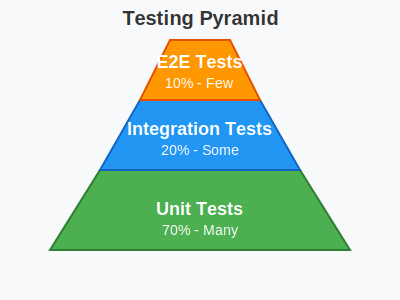

# Testing Standards

## Current Status

**Phase**: Pre-production development (v1.0 targeting Q4 2025)  
**Testing Approach**: Manual QA in staging environment  
**Automated Testing**: Not yet implemented

This document outlines future testing standards for post-v1.0 implementation.

---

## Testing Strategy (Future)

### Testing Pyramid



**Target Distribution**:
- 70% Unit Tests (Many)
- 20% Integration Tests (Some)
- 10% E2E Tests (Few)

---

## Unit Testing (Future Target: 80% Coverage)

### Not Yet Implemented
- Unit test suite to be developed post-v1.0
- Target: 80% code coverage
- Focus on business logic and services

### Planned Approach

**Frontend (Angular)**:
- **Framework**: Jasmine + Karma
- **Target**: Component logic, services, pipes
- **Pattern**: Arrange-Act-Assert (AAA)

```typescript
// Example unit test (future)
describe('UserService', () => {
  let service: UserService;
  let httpMock: HttpTestingController;

  beforeEach(() => {
    TestBed.configureTestingModule({
      imports: [HttpClientTestingModule],
      providers: [UserService]
    });
    service = TestBed.inject(UserService);
    httpMock = TestBed.inject(HttpTestingController);
  });

  it('should fetch user by id', () => {
    const mockUser = { id: '123', name: 'Test User' };

    service.getUser('123').subscribe(user => {
      expect(user).toEqual(mockUser);
    });

    const req = httpMock.expectOne('/api/users/123');
    expect(req.request.method).toBe('GET');
    req.flush(mockUser);
  });
});
```

**Backend (C# / ABP.io)**:
- **Framework**: xUnit
- **Target**: Application services, domain logic, repositories
- **Pattern**: Given-When-Then

```csharp
// Example unit test (future)
public class UserAppService_Tests : KinanaApplicationTestBase
{
    private readonly IUserAppService _userAppService;

    public UserAppService_Tests()
    {
        _userAppService = GetRequiredService<IUserAppService>();
    }

    [Fact]
    public async Task Should_Get_User_By_Id()
    {
        // Arrange
        var userId = Guid.NewGuid();

        // Act
        var user = await _userAppService.GetAsync(userId);

        // Assert
        user.ShouldNotBeNull();
        user.Id.ShouldBe(userId);
    }
}
```

---

## Integration Testing (Future)

### Not Yet Implemented
- API endpoint testing to be developed post-v1.0
- Database integration tests
- Third-party service integration tests

### Planned Approach

**API Testing**:
- Test full request/response cycle
- Verify database operations
- Check error handling and validation

**Backend Integration Tests**:
```csharp
public class UserAppService_Integration_Tests : KinanaWebApplicationFactory
{
    [Fact]
    public async Task Should_Create_And_Retrieve_User()
    {
        // Create user
        var createDto = new CreateUserDto
        {
            Name = "Test User",
            Email = "test@example.com"
        };

        var createdUser = await _userAppService.CreateAsync(createDto);

        // Retrieve user
        var retrievedUser = await _userAppService.GetAsync(createdUser.Id);

        // Assert
        retrievedUser.Name.ShouldBe(createDto.Name);
        retrievedUser.Email.ShouldBe(createDto.Email);
    }
}
```

---

## E2E Testing (Future)

### Not Yet Implemented
- End-to-end user journey testing to be developed post-v1.0
- Browser automation for critical workflows

### Planned Tools
- **Cypress** or **Playwright** for browser automation
- **Test critical user paths**: login, content upload, document viewing

**Example E2E Test** (future):
```typescript
// Cypress example
describe('Document Upload Flow', () => {
  it('should allow user to upload and view document', () => {
    cy.login('teacher@school.com', 'password');
    cy.visit('/library');
    
    cy.get('[data-testid="upload-button"]').click();
    cy.get('input[type="file"]').attachFile('test-document.pdf');
    cy.get('[data-testid="submit-upload"]').click();
    
    cy.contains('Upload successful').should('be.visible');
    cy.contains('test-document.pdf').should('exist');
    
    cy.contains('test-document.pdf').click();
    cy.get('[data-testid="pdf-viewer"]').should('be.visible');
  });
});
```

---

## Performance Testing (Future)

### Not Yet Implemented
- Load testing to be performed before production launch
- Performance benchmarks to be established

### Planned Approach
- **Tools**: k6 or Artillery for load testing
- **Metrics**: Response time, throughput, error rate
- **Scenarios**: Peak load, stress testing, endurance testing

---

## Security Testing (Ongoing)

### Current Practice
- Dependency scanning: `npm audit`, NuGet security checks
- Code review for security issues
- Manual penetration testing (planned annually)

### Future Enhancements
- Automated security scanning in CI/CD
- Regular penetration testing by external firm
- OWASP ZAP for vulnerability scanning

**See**: [Security Standards](./Security_Standards.md) for details

---

## Current Testing Approach

### Manual QA Process

**Environment**: Staging (deployed from `dev` branch)

**Process**:
1. Developer completes feature and pushes to dev
2. Automated deployment to staging
3. QA/PM performs manual testing
4. Bugs reported as GitHub Issues
5. Developer fixes bugs
6. Retest in staging
7. Acceptance by QA/PM

**Testing Focus**:
- Functional testing (does it work as expected?)
- UI/UX testing (correct display, responsive design)
- Browser compatibility (Chrome, Safari, Firefox)
- Arabic RTL testing
- Basic accessibility testing

**Test Tracking**: GitHub Issues with label `qa-testing`

---

## Transition to Automated Testing

### Post-v1.0 Roadmap

**Phase 1** (Months 1-3):
- Set up unit testing infrastructure
- Write tests for critical business logic
- Establish code coverage baseline

**Phase 2** (Months 3-6):
- Expand unit test coverage to 80%
- Implement integration tests for APIs
- Set up CI/CD with automated test runs

**Phase 3** (Months 6-12):
- Implement E2E tests for critical paths
- Performance testing and optimization
- Establish testing as part of Definition of Done

---

## Testing Best Practices (When Implemented)

### Write Testable Code
- Small, focused functions
- Dependency injection
- Avoid tight coupling
- Pure functions where possible

### Test-Driven Development (Optional)
- Write test first, then implementation
- Red-Green-Refactor cycle
- Ensures code is testable by design

### Keep Tests Fast
- Unit tests should run in milliseconds
- Use mocks for external dependencies
- Parallel test execution

### Maintainable Tests
- Clear test names: `should_return_user_when_valid_id`
- Single assertion per test (ideally)
- Avoid test interdependencies
- Use test helpers for common setup

---

## Resources

### Frontend Testing
- **Angular Testing**: https://angular.io/guide/testing
- **Jasmine**: https://jasmine.github.io/
- **Cypress**: https://www.cypress.io/
- **Playwright**: https://playwright.dev/

### Backend Testing
- **xUnit**: https://xunit.net/
- **ABP Testing**: https://docs.abp.io/en/abp/latest/Testing

### General
- **Test Pyramid**: https://martinfowler.com/articles/practical-test-pyramid.html
- **Clean Code Testing**: Robert C. Martin principles

---

*Last Updated: November 2025*  
*Version: 1.0*  
*Status: Planning document - automated testing not yet implemented*
